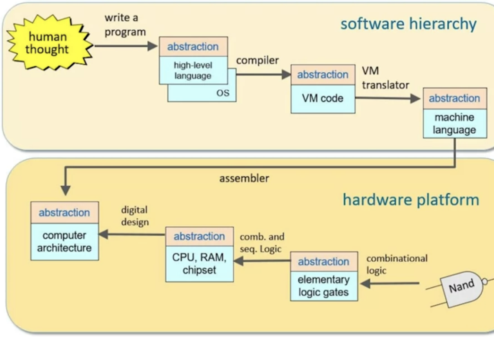

# FROM NAND TO TETRIS - BUILD A MODERN COMPUTER

This repo refers to two courses available on coursera:

- [Build a Modern Computer from First Principles: From Nand to Tetris (Part I)](https://www.coursera.org/learn/build-a-computer?).
- [Build a Modern Computer from First Principles: Nand to Tetris Part II](https://www.coursera.org/learn/nand2tetris2) 

You will take a self-paced journey through building a computer from the ground up, starting with Boolean algebra and logic gates and ending with a fully functional general-purpose computer. You will learn about hardware abstractions, implement them yourself, and ultimately experience the thrill of building a complex system. Each folder contains my own solutions to the assignments and my personal notes:

- Project 1: Building basic logic gates like And, Or, Not, and Multiplexor
- Project 2: Building a range of adder chips and an Arithmetic Logic Unit (ALU)
- Project 3: Building registers, memory units, and a Random Access Memory (RAM)
- Project 4: Learning a machine language and writing low-level programs
- Project 5: Using the chipset from projects 1-3 to build a Central Processing Unit (CPU) and a hardware platform capable of running programs in the machine language from project 4
- Project 6: Developing an assembler to translate programs written in symbolic machine language into binary code.
- Project 7: In this module we begin building a stack-based virtual machine. After presenting the virtual machine architecture and its VM language (which is similar to Java's *bytecode*), we develop a basic VM translator (similar to Java's *JVM*), designed to translate VM programs into the Hack machine language.
- Project 8: In the previous module we presented a virtual machine abstraction, and developed a basic VM translator that implements the VM language's arithmetic and memory access commands. In this module we'll complete the VM translator by implementing the remaining VM language's branching and function-calling commands.
- Project 9: In this module we introduce the Jack language, as well as Jack programming. The module culminates in a project in which you will develop a simple interactive application of your choice, using Jack.
- Project 10: The translation of a high-level program into a lower-level language consists of two well-defined and more or less independent stages: *syntax analysis*, and *code generation*.Syntax analysis - the subject of this module -  consists of two sub-stages: *lexical analysis* (also called *tokenizing*), and *parsing*. The resulting project will be a *Jack analyzer* - a program that unveils the syntax of Jack programs without generating executable code.
- Project 11: In the previous project we've built a syntax analyzer for the Jack language. In this  we will morph this analyzer into a full-scale Jack compiler. This will entail modifying the analyzer's logic that generates XML code into logic that generates executable VM code.
- Project 12: An operating system is a collection of software services designed to close gaps between high-level programs and the underlying hardware on which they run. Modern languages like Java and Python are deployed together with a standard class libraries that implement many such OS services.  In this project we'll develop a basic OS that will be packaged in a similar set of class libraries. The OS will be developed in Jack, using a bootstrapping strategy, similar to how Linux was developed in C.
