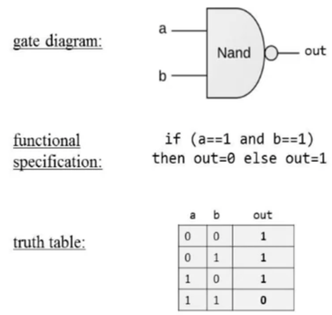
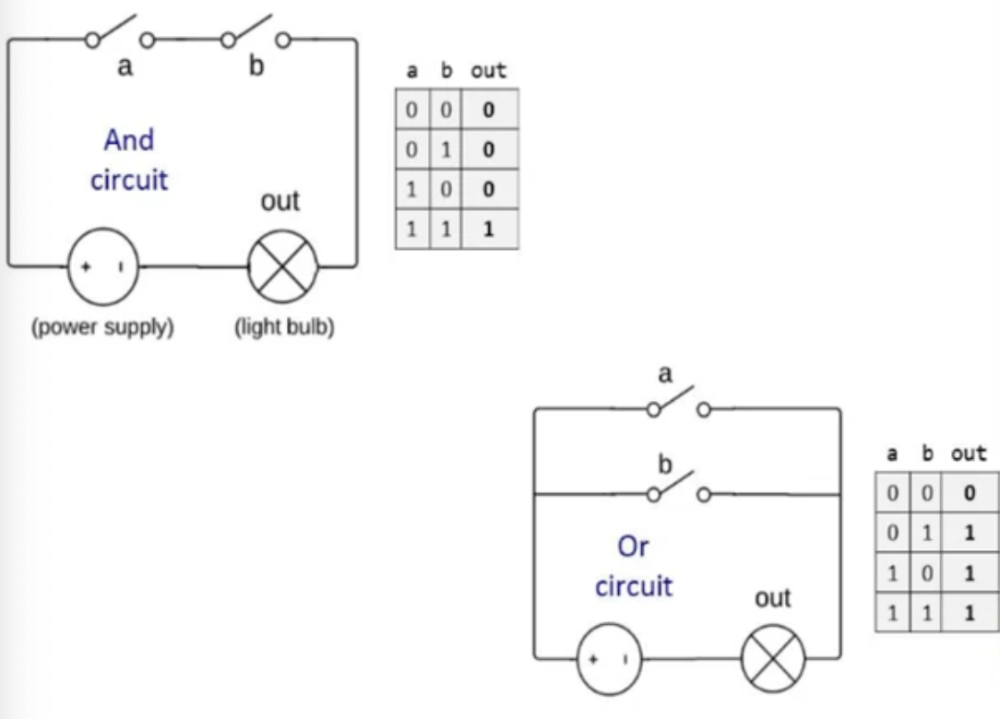
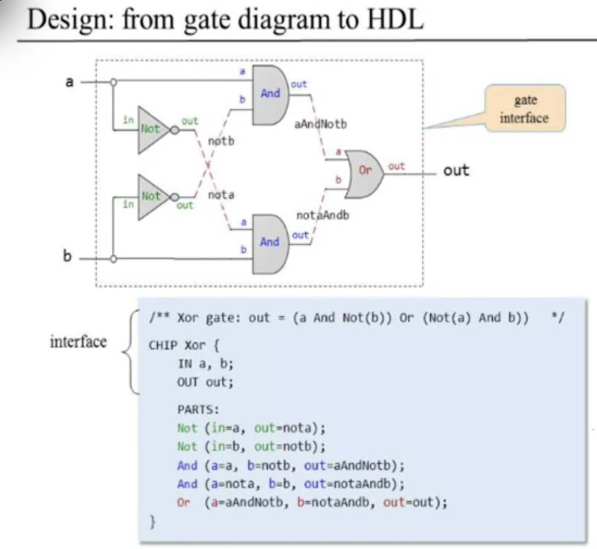

# From-Nand-To-Tetris-Build-Modern-Computer

## Boolean Functions and Logic Gates

**Theorem 1: Any Boolean function can be represented using an expression containing AND and NOT operations.**

Proof: (x OR y) = NOT(NOT(x) AND NOT(y)) (De Morgan Law)

We introduce a new operator called NAND.

**(x NAND y) = NOT(x AND y)**

Consequently from Theorem 1, we can assume theorem 2.

**Theorem 2: Any Boolean function can be represented using an expression containing only NAND operations.**

Proof:

1. NOT(x) = ( x NAND x)
2. (x AND y) = NOT(x NAND y)
3. (x OR y) = NOT((NOT(x) AND NOT(y))) = NOT(x) NAND NOT(y)

**To build our computer, the only operation given is NAND, and from that we build AND, OR, XOR and so on...**

**Gate Logic:** A technique for implementing Boolean functions using logic gates. What is a **logic gate?** It is a standalone chip, elementary chip which is designed to deliver a well-defined functionality (like OR, NAND and so on). A **composite logic gate** is a chip which is made up from elementary logic gate and other composite logic gates (like multiplexes and adders).



**Circuit implementations**



**NOTE** : the logical gate are interface that act as abstractions, the circuit implementation (physical implementation) itself is in the domain of Eletrical Engineering, not CS. The chip interface describe what the chip is doing; the chip implementation specifies how the chip is doing it. 

## Hardware Description Language (HDL)

The HDL is a textual description of the gate diagram.

Implementation is not unique and can be implemented in many ways. 



The players in an hardware construction projects are:

- System Architects: Who decides which chips are needed and for each chip the architect creates:
  - A chip API
  - A test script
  - A compare file
- Developers, given these resources, the developers can build the chips. Remember that the optimal boolean function is a NP-problem, so there are different ways to implement it and can't find an optimal algorithm for it.

## Arrays of Bits

Sometimes we manipulate together an array of bits. It is conceptually convenient to think about such a group of bits as a single entity, sometimes termed "bus".  Multi-bit busses are indexed right to left, if A is a 16-bit bus, then A[0] is the right-most bit (convention). An example is addition of two 16-bit integers. This is how will be described in HDL:

```
/*
* Adds two 16-bit values
*/
CHIP Add16 {
  IN a[16], b[16];
  OUT out[16];
  
  PARTS:
  	...
}
```

 