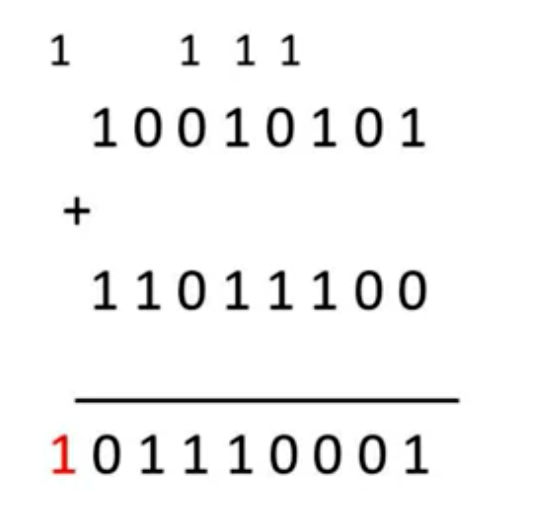
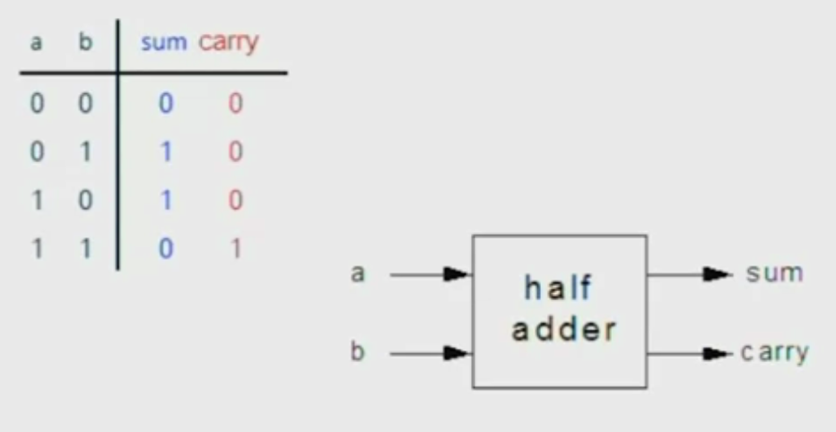
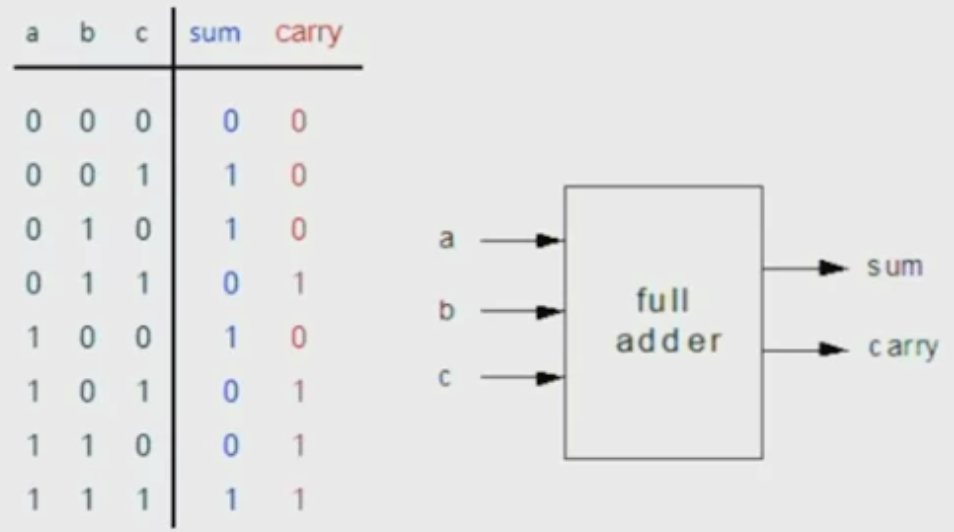
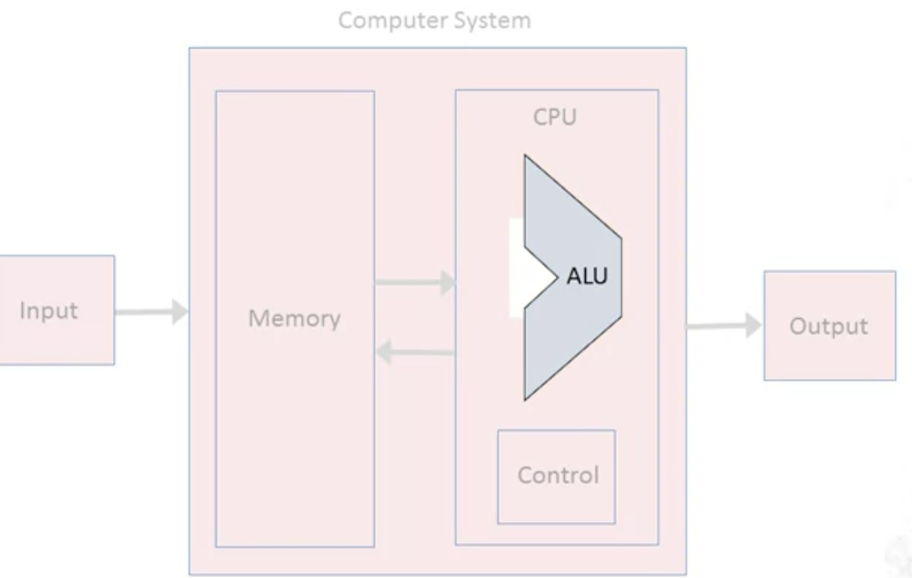
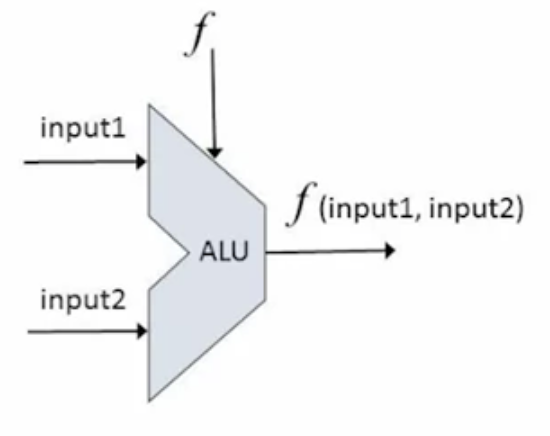
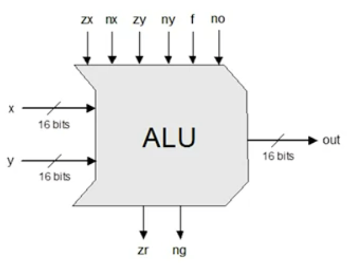
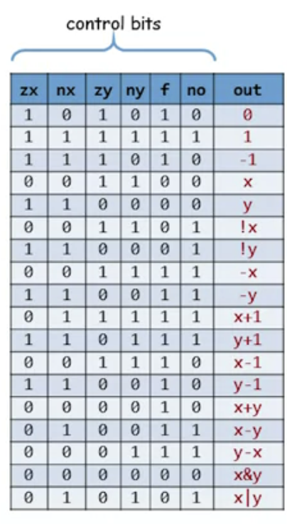

# Boolean Arithmetic and the ALU

Using the chipset that we've built in the previous module, we will now proceed to build a family of *adders* -- chips designed to add numbers. We will then take a big step forward and build an *Arithmetic Logic Unit*. The ALU, which is designed to perform a whole set of arithmetic and logical operations, is the computer's calculating brain.

## Binary Numbers

In computers, you usally have a fixed number of bits that is allocated (fixed **word** size), and then of course you can only be able to represent a fixed range of integers number. For Example, if we only have 8 bits, we can represent only numbers in the range 0 to 127 and  -1 to -127. In general half of the numbers are going to be used for negative numbers representation.

**Overflow:** If we perform an operation like addition between two numbers and we discover that we carry a bit outside the word-size (like the image below). What usually is done in computer system is **nothing**. We just ignore any carry bit that does not fit into the word. If you excess the word-size the result that you get is not the true integer result of the integer addition, but rather the trucated result after the overflow was already disposed of.

## Building an Adder

How do we build hardware that takes two numbers as input bits and the output is another number made of bits. We build this hardware in 3 steps:

1. We build a chip called **Half-adder** that performs the addition of two bits. Taking two bits, a and b, and producing two outputs bits, one that is the binary **sum** of these two bits, and the one is a **carry** (the bit that we carry in case a=1 and b=1). 
2. We build another chip called **Full adder** that gets 3 bit as input (a, b and c), where c describes the carry from the previous step.
3. The final step is to build the chip called **Multi-bit Adder**, where we get two full numbers. We have to connect one full adders to each bit and one half-adder for the right most bit (beacuse we have no carry at beginning). Like if you want a 16-bit adder out, you connect 15 full adders to each bit and for the last right most bit the half-adder. It accepts two numbers a and b and returns one out.

## Negative Numbers

To represent negative numbers we use **2's Complement**. Represent Negative number -x using the positive number: 2^n - x. 

E.g. 3 = 0011, -3 = 1101 (13 = 2^4 - 3 = 16 - 3).

With this way of representing negative number, we get the subtraction operation for free from the addition.

E.g. - 2 + - 3 =〉 14 + 13 = 1110 + 1101 = 11011 = 27, the most significant one is thrown away (because we have 4 bits), so 1011 = 11 =〉-5. 

If we want to compute -x, we can do 2^n - x = 1 + (2^n - 1) - x.

E.g. Input = 4 = 0100 

1. 1111 - 0100 = 1011
2. 1011 + 1 = 1100 = -4

## ARITHMETIC LOGIC UNIT (ALU)

### Von Neumann Architecutre

When you look at Von Neumann Architecture, you see that one key player of it is the central processing unit (CPU) and within this CPU another important piece is the ALU or the Arithmetic logic unit.

Now, if we abstract all the details and focus only on the ALU, we can think of an abstraction which receives 2 multi-bit inputs and the third input is the function that has to be computed. The outcome is the computation on this function on both the inputs.

The function f is one out of a family of pre-defined arithmetic and logical functions that taken together define what this ALU is capable of doing. This function can be:

- Arithmetic operations: integer addition, multiplication, division, ...
- Logical operations: And, Or, Xor, ...

Which operations should be the ALU perform? This is the classical hardware/ software tradeoff. Because if you choose to not implement something in hardware you can always compute later with software.

### Hack ALU

What we said till now is valid for all the ALU, for now on we go and focus on the Hack ALU that we will build:

- Operates on 2 16-bit (x, y).

- Outputs a 16-bit (out).

- Which function to compute is set by 6 1-bit inputs (control bits). Based on those 6 bits, the alu compute one of the 18een functions of interest (the second image). In principles the ALU can compute more functions but we focus only on those 18een.

- Also outputs two 1-bit values zr and n:

  -  If out == 0 then zr =1, else zr = 0.
  - If out **<** 0 then ng = 1, else ng = 0.

  Those two bits will be needed when we build the complete computer's architecture.

The Hack ALU is easy to implement, we already have designed chip for it, the only operation we have to perform are:

- Set a 16-bit value to 00000000...
- Set a 16-bit value to 11111111...
- Negate a 16-bit value (bit-wise)
- Compute + or & on two 16-bit values

And that's it.

"Siplicity is the ultimate sophistication" - Leonardo Da Vinci.