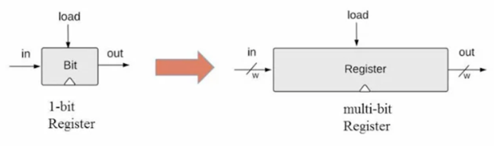

# MEMORY

## SEQUENTIAL LOGIC

In the physical world, time is a continuous arrow of time which is very complicated to think about into discrete time. In Computers  we're going to have what's called a clock which is some kind of oscillator going up and down at a certain fixed rate. And each cycle of the clock we're going to treat as one digital integer time unit. So this clock will basically break up our physical continous time into a sequence of time equals one, time equals two, and so on... Within each time unit, we're going to deal as a time was a single time unit.


**This the way we build all our sequential logic in computers, one after another in integer time steps**. When you really look at a phyiscal signal,implemented probably with some eletrical signals, it doesn't change instantaneously in zero time between logical time one and logical time two. It takes times for the input to reach its final stage, same for the output. That's why we split the time into integer units, is because we won't want to think about these delays. As long as our clock cycle is not too fast, as long as we give ourselves enough time between consecutive time units, we can ignore everything that happened at phyiscal level and care only about the moment the signal reaches the true and final consistent state. In fact, the way we choose the cycle of the clock is to make sure that all the hardware there really stabilizes and the implementations give you the logical operation by the end of the unit. We want to see at the end of the clock cycle the real logical state of the system and then we can simply ignore the incosistencies that happen within the cycle of the clock. This justifies the way that we can think about time in integer steps one after another. 

**Note: In combinatorial logic at each time unit we could have a different input and a different ouput, what we had before introducing memory (Image below).**

**With sequential logic we mean that the input at time T depends on the input at time (T - 1).** We remember things from last period and based on the previous time step we actually compute our output at the new timestamp.

As long as now what's our value at time T depends on the previous value at time (T-1), we can have these values live in the same wires in the circuit. So now we can have a single bit that for instance holds a called state e.g. b=f(a).

## FLIP FLOPS

We need something to actually remember one bit of information. In the transition point between two consecutive time units it must have a state. At the end of state t-1 we can be at either two states: "remembering 0" or "remembering 1". This remembers by "flipping" between these possible states. Gates that can flip betwen two states are called flip flops. They flip to 0 and then they can flop back to 1. The point is that this flipping and flopping is something they remember. It is not just a function of the current input but its something internal time units use to remember.

### Clocked Data Flip Flop

This flip flop has a single input and a single input a single output and it basically remembers the input from last time unit and outputs it in the next time unit. This flip flop at any time unit will actually return the value that was in the input in the previous time unit.


### 1-bit Register

Remember an input bit "forever": until requested to load a new value.


## Memory Units

If we look at the Von Neuman architecture, another major player is the memory. When we say memory in computer hardware we mean many different things:

- Main memory, actually the memory that resides inside the computer, hard-wired into the computer's motherboard, the most famous one is called RAM, ...
- Secondary memory like hard-disks, memory sticks and so on.
- Volatile/ non-volatile, the difference is if the memory persists even when the computer is not connected to a power supply.

RAM: Is used to store both the data on which our programs operate as well as the instructions, which are the building blocks of the program themselves.

Perspective:

- phyisical perspective, how we actually build the memory, what kind of technology do we use in order to realize the memory.
- Logical organization of the memory

### Register

**The most basic memory element: Register**. You can take several 1-bit register and put them one next to the other and create an abstraction of a 16-bit number. And we call this abstraction register. The width of the register in general is a parameter that we call word (16-bit, 32-bit, 64-bit, ...). 

- **Read the register**: we read 'out', out emits the register's value.

- **Write logic**: 

  ``` 
  //To set Register = v
  /*
  First we set the new value, let's say 18
  */
  set in = v
  /*
  Then we set the load bit to 1
  */
  set load = 1
  
  /*
  Result:
  	- The register's state becomes v
  	- From the next cycle onward, out emits v (18)
  */
	
	### RAM unit

The general architecture of this unit looks as follows. RAM abstraction:

- A sequence of n addressable registers, with addresses 0 to n - 1.
- Irrespective of how many registers you have in this RAM unit, at any given point in time, only one register is selected and only one register is interesting. All the other registers don't take any part in the game. So at any given point in time we have to say which is the register on which we want to operate (read or change).
- If we have to select one out of n possible registers, if we have 8 registers we need 3 bits to represent the address. So k (width of address input) = log n.

NOTE: RAM is a squential chip, it depends on a clock input (that's why the triangle in the diagram below) and this means that it has a clocked behavior.


- **To read Register i**:

  ```
  set address = i
  /*
  out emits the state of register i
  */
  ```

- To set Register i to v:

  ```
  set address = i
  set in = v
  set load = 1
  /*
  The state of Register i becomes v
  and from the next cycle onward, out emits v
  */
  ```

  ***NOTE: It is called Random Access Memory, because irrespective of whether it has 8 registers or 8 milion registers, I can select every register from this chip and apply an operation on it in almost instantly time regardless of where in memory it is stored. So I can select at random any register in this configuration and either read it or write it in the same access time.***

## Counters


