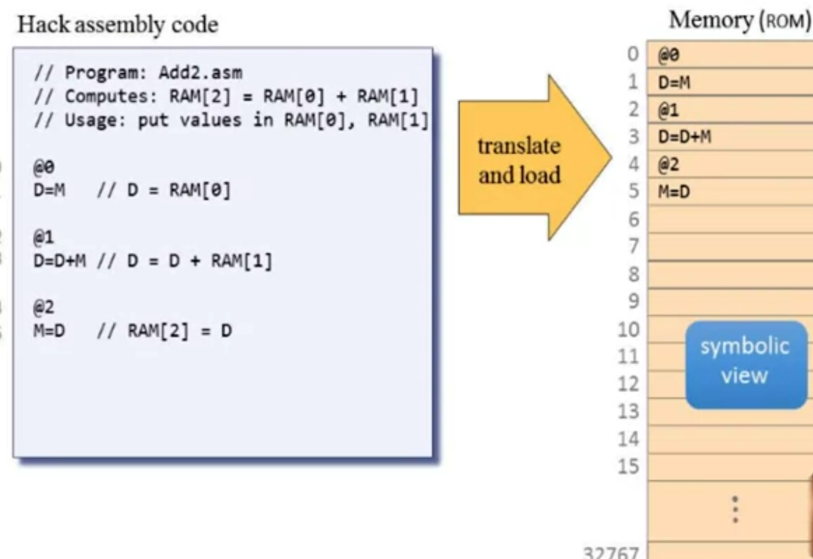

# MACHINE LANGUAGE

**In a nutshell:** A critically important aspect of building a new computer system is designing the low-level *machine language*, or *instruction set*, with which the computer can be instructed to do various things. As it  turns out, this can be done before the computer itself is actually  built. 

Same hardware can run many different software programs. The first theoretical formulation was done with the Universal Turing Machine. The real pratical approach to this theoretical machine was accomplished by the Von Neumann Architecture. 


The program has a sequence of instruction, each one of them is going to be coded in binary and our hardware, simply go instruction by instruction and execute it. When we get all the instructions together we get the functionality of a program. 


Instead of saying for instance:  01001000110010 for convention we can say ADD (01001) R3 (0011) R2 (0010) .**NOTE**: The "symbolic form" doesn't really exist but is just a convenient mnemonic to present machine language instructions to humans. We will allow humans to write machine language instruction using this "assembly language" and will have an "assembler" program convert it to the bit form.

## MACHINE LANGUAGES: ELEMENTS

Machine language is the interface between hardware and software. This interface has to specify:

- What operations the hardware can perform?
- Where does it get the data that it operates on?
- What is the control of the operations? 
- and so on ...

The machine language is written in a way that directly corresponde the type of functionalities that are provided by the hardware. This does not happen always, sometimes you can provide multiple layers of transformations of the hardware.

### Memory hierarchy

Accessing a memory location is expensive:

- Need to supply a long address .
- Getting the memory contents into the CPU takes time.

Solution: Memory Hierarchy. Instead of having one large block of memory, we have a whole sequence of memory that gets bigger and bigger. The small memories are the faster. First of all because we don't need to supply a long address because there are going to be few of them, second because are few of them we can retrieve informations faster. And last to consider is that bigger memories are more fare away from the CPU. The smallest and so faster memories are Registers that reside inside the CPU.


### Registers

CPU usually contain a few, easily accessed, "registered". Their number and functions are a central part of the machine language. Since there are very few of them, addressing them requires really few bits, and so quick get information and due they are inside CPU are with no delay. 

- We can use registers for data (like Add R1, R2)
- For address (like Store R1, @A)

**INPUT/ OUTPUT**: For instance a mouse movement can be saved in a register and that register can be accessed by the CPU. This gives us access to input e output. E software that deals with this (drivers) must know exactly what address is and how to interpret that.

**Flow Control**: Usually the CPU executes machine instructions in sequence. But there are situation where we don't want to execute instructions one after another, sometimes we need to "jump" unconditionally to another location e.g. we can loop. And sometimes we need to jump only if some condition is met (Jump if R1 = 0).

**HARDWARE**: We are going to build a 16-bit machine consisting of:

- Data Memory (RAM): a sequence of 16-bit registers: RAM[0], RAM[1] ...
- Instruction Memory (ROM): a sequence of 16-bit registers ROM[0], ROM[1]... The ROM is loaded with a Hack Program, when I set the reset button to 1, the program starts running, the reset button is used just once per program. 
- Central Processing Unit (CPU): performs 16-bit instructions
- Instruction bus /data bus /address buses.

## LANGUAGE SPECIFICATION

### SYMBOLIC CODE TO BINARY


### SYMBOLIC CODE - TRANSLATED TO BINARY (ASSEMBLER USED) AND EXECUTED BY THE MACHINE


## INPUT/ OUTPUT

I/O devices are used for:

- Getting data from users
- Displaying data to users

Two approaches: 

- High Level approach: Sophisticated software libraries enabling text, graphics, animation, audio, video, etc.
- Low level approach: Bits (is what we are focus on in this part).

## OUTPUT UNIT (E.G. SCREEN) - SCREEN MEMORY MAP

One important player is the **screen memory map**. It is a disegnated memory area, dedicated to manage a display unit. The phyisical display is continuously refreshed from the memory map, many times per second. Output is effected by writing code that manipulates the screen memory map and I can count on that what I change in the memory, **in the next refresh cycle**, is going to be reflected on the screen.


**For instance: A display Unit is a matrix made of 256 row and 512 columns and each intersection between row and column we have what is known as pixel, and we can turn on (1) or off (0).** The memory map is a sequence of 16 bit (word) values, so all together we have 8k 16 bit words, because 8 k x 16 = 128000 and this is the number of pixels we have on the physical display unit, so for every pixel on the pysical display unit we have a bit that represents this pixel in the screen memory map.

Note: The RAM will consist of several chips and the screen will be one of them.


## INPUT UNIT (E.G. KEYBOARD) - KEYBOARD MEMORY MAP

The phyisical keyboard is connected to the computer, if you trace where it is connected too, you will see that it goes into an area in the RAM which is called keyboard memory map and this is the representative of the keyboard inside the computer architecture. In order to represent the keyboard, you don't need more than 16 bits. So the Keyboard memory map is a single register. When a key is pressed on the keyboard, the key's scan code appears in the keyboard memory map.

To check which key is currently pressed, we probe the contents of the keyboard chip. In the hack computer we probe the contents of RAM[24576]. If the register contains 0, no key is pressed.


## HACK PROGRAMMING (SYMBOLIC LANGUAGE THAT IS TRANSLATED BY THE ASSEMBLER IN BYNARY CODE)

### WORKING WITH REGISTERS AND MEMORY


E.G. ADD



**NOTE: with the previous example, the program will never stop, so the CPU will read from the ROOM memory undefinitely, even if there are not other operations after memory register 5. To terminate a program safely, end it with an inifinite loop: **

```
@6
0; JMP
```

### BRANCHING

**In machine language we have just one branching operator "goto".**


### VARIABLES


### ITERATIVE PROCESSING


### POINTERS

The machine language doesn't recognise the array abstraction.


