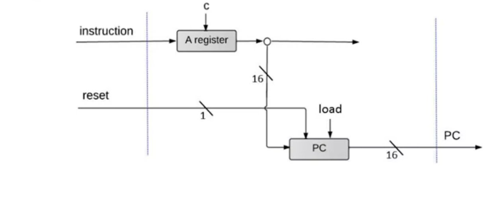

# COMPUTER ARCHITECTURE

 Let's recap the last four modules: we've built some  elementary logic gates (module 1), and then used them to build an ALU  (module 2) and a RAM (module 3). We then played with low-level  programming (module 4), assuming that the overall computer is actually  available. In this module we assemble all these building blocks into a  general-purpose 16-bit computer called *Hack*. We will start by  building the Hack Central Processing Unit (CPU), and we will then  integrate the CPU with the RAM, creating a full-blown computer system  capable of executing programs written in the Hack machine language.

## VON NEUMANN ARCHITECTURE

Our CPU is going to be made up of 2 main components:

1. ALU, piece of hardware that is able to do some operations like add, remove and some logic operations.
2. Registers where we can store data that we are going to use for the rest of computation.

The memory itself has 2 parts:

1. Part that stores the program.
2. Part that stores the data.


### Information Flows

There are 3 types of information that transit through buses:

1. Data, like when we have numbers that need to be added, they need to be moved from memory to the registers or the ALU.
2. Addresses, like what we instruction are we currently executing, what piece of data do we need to access.
3. Control, tell each part of the system what to do at this particular point.


#### ALU

Let's start from the **Arithmetic Logic Unit (ALU)**: It basically needs to accept numbers and operate on them. We simply need to get some information from the **data bus** and feed the output of the data back to the data bus after the computation.

There is another bus that the ALU needs to be connected to and is the control bus, the ALU needs to know what kind of information has to perform everytime, so has to get this information from the control bus. Not only, because according to the result of the computation, the ALU has to be able to tell other parts of the system what to do. For instance, if a number is greater than 0, can control the jump in the next instruction. This control will happen trough the **control bit**. So we get information from the ALU itself.

Recall in the unit-02 that the ALU has also 2 1-bit values zr and ng:

- If out == 0 then zr =1, else zr = 0.
- If out **<** 0 then ng = 1, else ng = 0.

So now we know why, can tell if an operation is greater than 0, equal or less through the control bus.

#### REGISTERS

We store intermediate results in the registers, so we need to get data from the data bus in the registers and then also send back data to the data bus and in this way can reach the ALU.

The second piece of information is the Address, becase sometimes same registers are used to specify addresses. The way we achieve direct addressing in the RAM or we jump into a ROM address. The way we do it is putting the address in the registers. 

#### MEMORY

We need all the time to specify what address of memory we are working with and this is specified by the address bus. The data of input and output is needed as well. There are two pieces of memory, the data  and the program one:

- Data memory, is going to need the bus address to specify the address of memory we operate on, and of course the data for the write and read part.
- Program, we need to put the address of the next programming instruction into the program memory, because is where we take the program instructions. We need to place the address and get the instruction from there. The instruction we get from the Program Memory can have data in it, for instance numbers. The instruction itself are represented by bit that need to be feeded in the control bus.

## FETCH-EXECUTE CYCLE (BASIC CPU LOOP)

The CPU does 2 things:

- **FETCH** an instruction from the program memory.
- **EXECUTE** it.
- **REPEAT**

### FETCHING

- Put the location of the next instruction into the "address" of the program memory.
- Get the instruction code itself by reading the memory contents at that location.


**FETCHING PART: Program Counter**, when we need to jump to a new location or just increase the number to read from memory the next instruction. The output of the program counter feeds into the address bus and then from the output of the program memory comes the actual code instruction that we need to execute (through data bus).


**EXECUTING: The instruction code specifies "what to do"**:

- Which arithmetic or logical instruction
- What memory to access (read/write)
- If/where to jump
- ...

Often different subsets of bits control different aspects of the operation. Executing the operation involves also accessing registers and/or data memory.

## CENTRAL PROCESSING UNIT (CPU)

A 16-bit (in our case) processor, designed to:

- Execute the current instruction.
- Figure out which instruction to execute next.

At every time there is always a selected Data memory and instruction memory selected. The third input is discussed later.

The output is what we wanna write (outM), where we wanna write (addressM) and the load bit (writeM). In addition there is pc that holds the address of the next instruction that has to be fetched and executed in the next cycle.


### CPU IMPLEMENTATION

The symbol c are used to represent the notion of control bits. In order to make all those chips to work together the designer of the cpu has to make sure that different bits arrive at the right locations.


Let's focus on different part of this architecture:
#### INSTRUCTION HANDLING

A (pointers) - Instruction:


1. Decodes the instruction into op-code (determines if is a A-instruction, it is if it starts for 0) + 15 bit value.
2. Store the value in the A-register.
3. Output the value address through addressM (overall architecture).

C (computational one) - instruction

1. Decodes the instruction into op-code (determines if is a C-instruction, it is if it starts for 1) + 15 bit value.

2. Once it confirmed a C-instruction, the ALU takes this input and decode into:

   1. Op-code (C instruction we said)
   2. ALU control bits
   3. Destination load bits
   4. Jump bits

   NOTE: The A register can be feed not only from the A-instruction but also from the ALU output, so the ALU can tell where to jump. In some cases A register is feeded by instructin and some other cases from the ALU output.

### ALU OPERATION


#### INPUT

The Input of the ALU comes from 2 different resources:

- From the D-Register.
- From the A-Register / M-Register (outM).

The Alu has 16 control bits (taken from the instruction) that specify to the ALU which operation has to perform:

- The ALU data output: Result of ALU calculation, fed simulatenously to: D - Register, A - Register, M -register(outM). 

- Which register actually receveid the incoming value is determined by the instruction's **destination bits** (writeM). If for instance writeM is 0000.. the ALU computed something but the value is lost, no register is going to load in memory the output.

- ALU control outputs: 

  - If out == 0 then zr =1, else zr = 0.
  - If out **<** 0 then ng = 1, else ng = 0.

  This 2 control bits document wheter or not the output is negative or zero (needed from the control logic described after).

#### CONTROL 



The instruction is received by the A register, if the last 3 bits that represent the jump are 0, no jump, so the program counter (PC), is + 1 (read the next instruction from memory). The pc always emits the address of the next instruction:

- To start/ restart the program's execution: PC = 0.
- No jump (last 3 bits 0), read next instruction: PC ++.
- If the last 3 bits are 0, goto: PC = A.
- If some of the last 3  bits are 1, we have a conditional goto: if the condition is true PC = A, else PC++.

```
if (reset == 1) PC = 0, restart program
else 
    load = f (jump bits, ALU control outputs (zr, ng))
    if( load == 1) PC = A
    else PC ++Else 
		load = f (jump bits, ALU control outputs (zr, ng))
		if( load == 1) PC = A
		else PC ++
```


PC OUTPUT: ALWAYS the address of the next instruction.

## THE OVERALL COMPUTER ARCHITECTURE

2 ways to have the program in the ROM:

- Hardware implemementation: plug-and-play ROM chips.
- Hardware simulation: programs are stored in text files; program loading is emulated by the built-in ROM chip.


