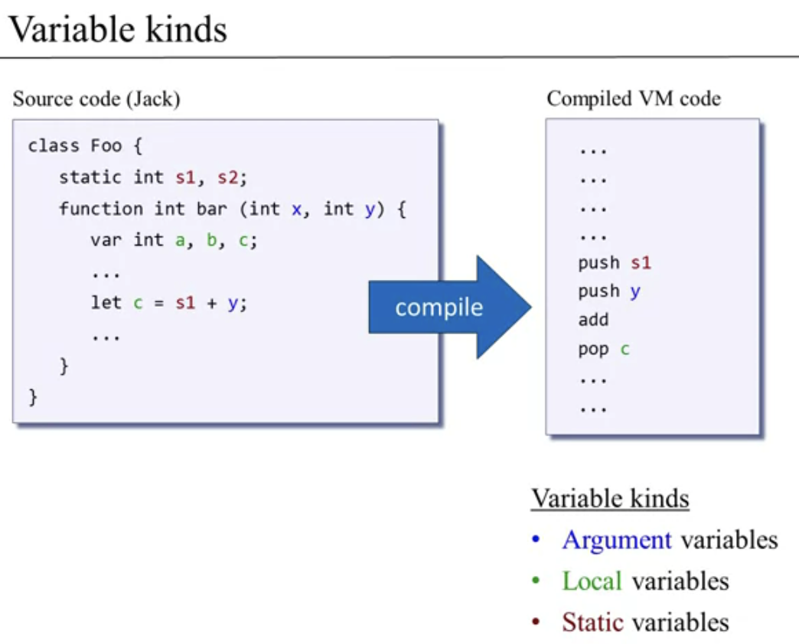

# VIRTUAL MACHINE I: STACK ARITHMETIC

## Introduction to compilation


We would like to have an alternative approach that is **"write once and run anywhere"**. We can achieve that with: **TWO-TIER Compilation** that is used by java for instance.

1. In the first tier (top tier), the java compiler translates the program in something called bytecode, but in general we call **VM code**. This VM code is designed to run on an abstract artifcat called Virtual machine. 
2. In the second tier, we equipe the target device with the JVM implementation, that is a program that takes bytecode and translates it to machine code. We need such translator for each target platform where we want to execute our program.


## VM Abstraction: the Stack

The stack machine is an abstraction that consists of:

- Architecture.
- Commands (set of operations that we can apply on the architecture).

Let's start from the stack.  We have two operations:

- push: add a data at the stack`s top.
- pop: remove the top data.

In our architecture we have a stack pointer that refers to the next position in the stack were our value is going to be pushed. This stack is available in virtual machine which is also equipped with a memory segment (similar to RAM).

What can we do with this architecture?

In the below example, we can se that if we push X, we take x from the memory (value 7) and push on top of the stack (nothing happened to the memory). Indeed, if we do pop y, remove the top value from the stack (3) and second operation will take this value 3 and store in location y (that is overwritten).


Besides that we have a set of arithmetic commands.

### Stack arithmetic

If we say add, we are going to take the two top-most value from the stack, compute them, and push the result to the stack. We can use neg to negate the top-most value.


 In general, if you want to apply a function f on the stack:

1. Pops the argument(s) from the stack.
2. Computes f on the arguments.
3. Pushes the result onto the stack.

**Why we need that?**

The compiler is going to translate from high-level language an instruction like  x = 17 + 19 in:

- Push 17
- push 19
- add
- pop x

## Memory Segments



To achieve that, the stack machine  is going to be equipped with different memory segments. Once we have this segments in place, the compiler can map the variables of the high level language to this segments.  We don't have symbolic variable but reference to the memory segemnts.


So the push/pop syntax slightly changes because now we have to specify the name of the segment where we wanna perform push or pop.


We currently have **8 virtual memory segments**:


## VM IMPLEMENTATION: THE STACK

Implementation assumptions:

- Stack's pointer in RAM[0]
- Stack base addr = 256

We have to write it in assembly, a possible example of the image below, where we push constant 17, so 2 steps to perform, get the pointers location, assign 17 to the pointer's location, increment the pointer's location memory.


**So what we have to do is write a program called VM translator that translates the VM code like push constant i to assembly code**.

## VM Implementation: Memory Segments

- Push segment index = Push the value of segment[index] onto the stack.
- Pop segment index pop the topmost stack item and store its value in segment[index].

Let's suppose we have the stack and the "local" stack memory segment.

We need two pointers, one for the stack and the other one for the local stack memory segment. The first address just the stack's top value, indeed the second one address the base address of the local segment.

If I wanna pop from local position 2, I get the base address from the local pointer + 2 and I get the position in the RAM.

Note in the image below that the value in the stack in position 257, is dead, because the SP points to 257 because we decrement the stack pointer, so the next push will overwrite it, that's how me maintain the stack clean.


The push is implemented in a similar way:


When we translate the high-level code of some method intpo VM code, the compiler:

- maps the method's local and argument variables onto local and argument segments.
- **maps the object fields and the array entries that the method is currently processing onto the this and that segments.**

**NOTE: **For the constant segment there is not pop value, only push, because doesn't make sense to store something in this constant., they are pre-defined by the VM. So push constant i, can be in assembly code translated with *SP = i, SP++.

### Implementing static

Challenge: static variables should be seen by all the methods in a program. Solution: Store them in some "globla space":

- Have the VM translator translate each VM reference static i into an assembly reference to the global space.
- We can generate the label in assembly and then reference it. In assembler the symbolic variables are mapped from RAM[16] till RAM[255], in the order in which appear in the program. So this can be our "global space". For instance if we wanna map static 3, it is mapped where the assembler maps the variable "Foo.3", where "Foo" is the name of the VM file in which the code resides.

### temp 

When translating high-level code, the compiler:

- Sometimes needs to use some variables for temporary storage.
- Our VM provides 8 such temporary variables.

### pointer

When translating a high-level method code into VM code, the compiler, it generates code that keeps track of the base addresses of the this and that segments using pointer segment. It has just 2 entries, 0 or 1. When VM tries to access pointer 0, should result in This, and whenever 1, should result that.  A stack pointer is a small register that stores the memory address of the last data element added to the stack or, in some cases, the first available address in the stack.


E.G.

After executing this VM commands:

```
push constant 1000
pop pointer 0 
push constant 2000
pop pointer 1
```

"that7" will be mapped in 2007. 

