# VIRTUAL MACHINE II: PROGRAM CONTROL

## VM BRANCHING commands

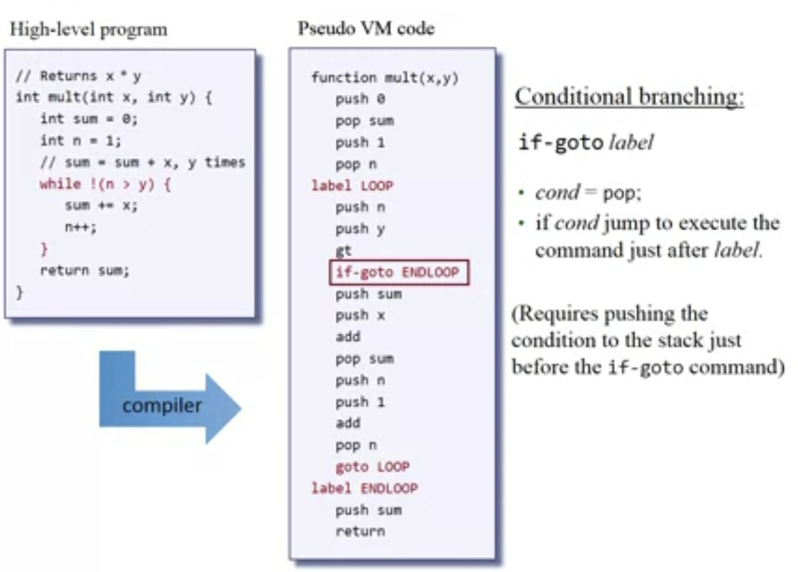

- **goto** label  = jump to execute the command just after label.
- **If-goto** label = if cond jump to execute the command just after label.
- **label** label = label declaration command.

## Functions: Abstraction

### Execution

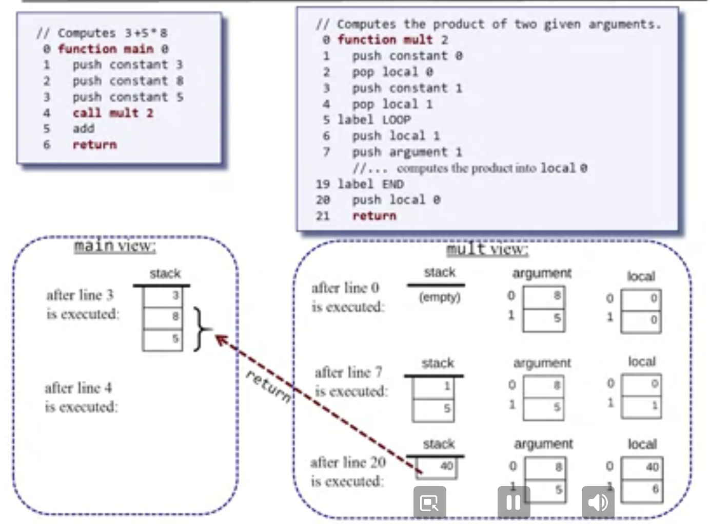

For each **function call** during run-time, the implementation has to:

- Pass parameters from the calling function to the called function;
- Determine the return address within the caller's code;
- Save the caller's return address, stack and memory segments;
- Jump to execute the called function.

For each **return** during run-time, the implementation has to:

- Return to the caller the value compared by the called function;
- Recycle the memory resources used by the called function;
- Reinstate the caller's stack and memory segments;
- Jump to the return address in the caller's code.

### Function's State

During run-time:

- Each function uses a working stack + memory segments.
- The working stack and some of the segments should be:
  - Created when the function starts running.
  - Maintained as long as the function is executing.
  - Recycled when the function returns

In particular when a function calls another function we have to maintain this state and wait until the called function returns. How to maintain the states of all the functions up the calling chain?

The calling pattern is LIFO, last in first out if you think about functions calling another function. All the other functions are waiting for the last one to terminate. But this can be implemented with the stack:

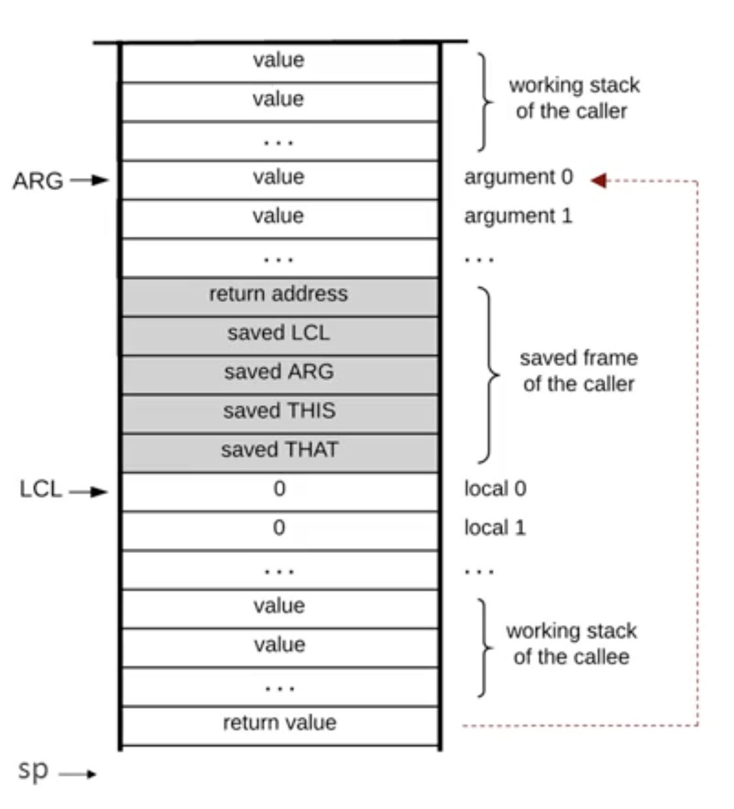

When the called function says return:

1. Copies the return value onto argument 0.
2. Restores the segment pointers of the caller.
3. Clears the stack.
4. Sets SP for the caller, that should be located just after the returned value (argument 0).
5. Jumps to the return address within the caller's code and continuing executing the caller's code.

We can see the stack as a global stack where there are different blocks of many functions:

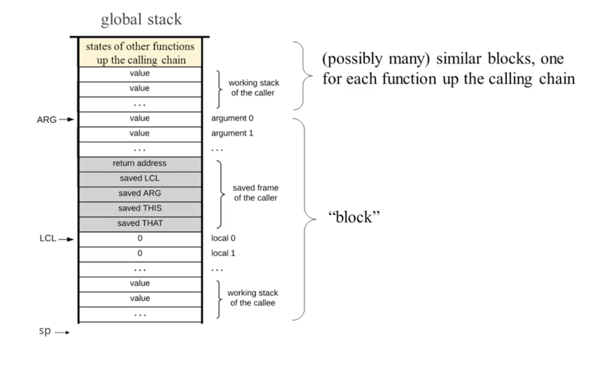

**NOTE**: The saved frame of the caller contains only 4 memory segments (LCL, ARG, THIS, THAT), instead of 8, constant, pointer, static, temp, don't have to be saved, because they don't belong to the world of the function, we save only the pointers that are relevant to the current function.

### RUNTIME SIMULATION WITH FACTORIAL

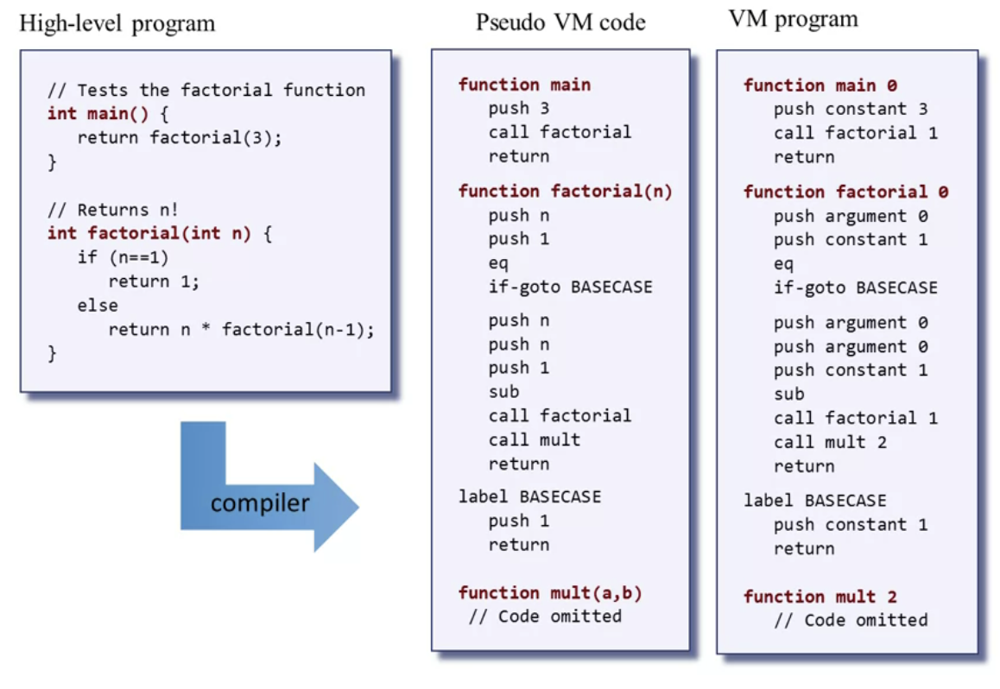

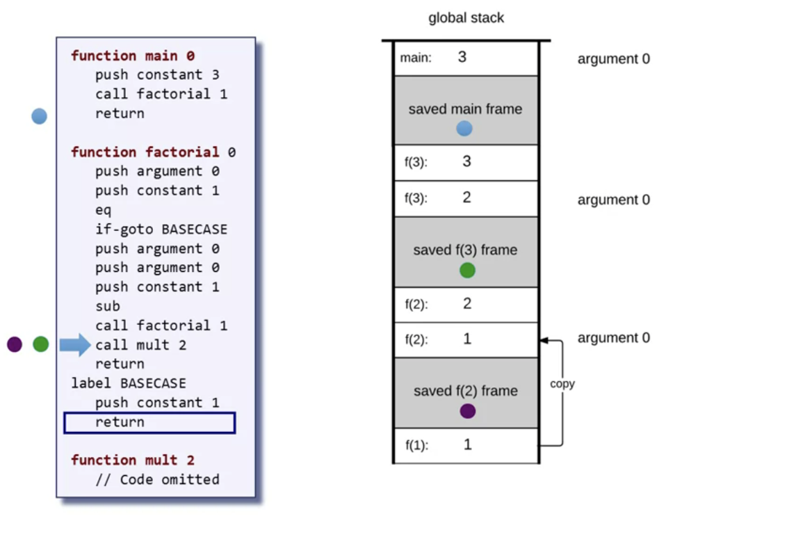

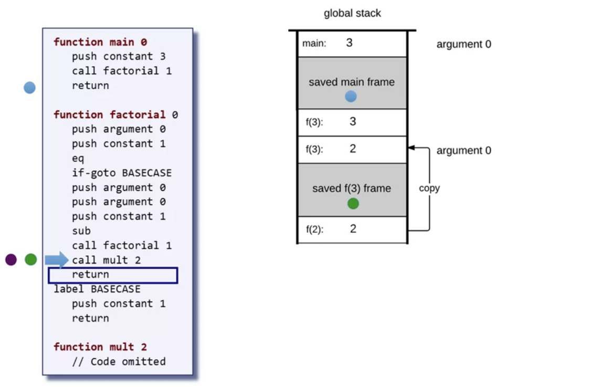

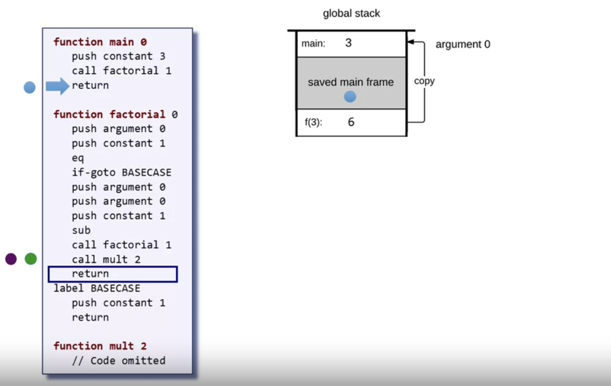

**NOTE**: That's why a thread has its own stack, need to process in parallel other functions.

### DETAILED IMPLEMENTATION

#### Implement a Call Command

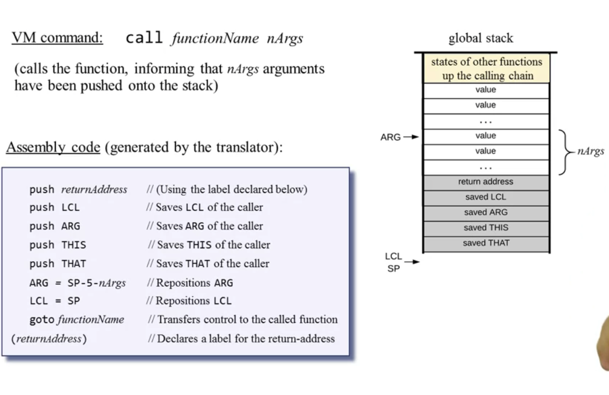

#### Handling function

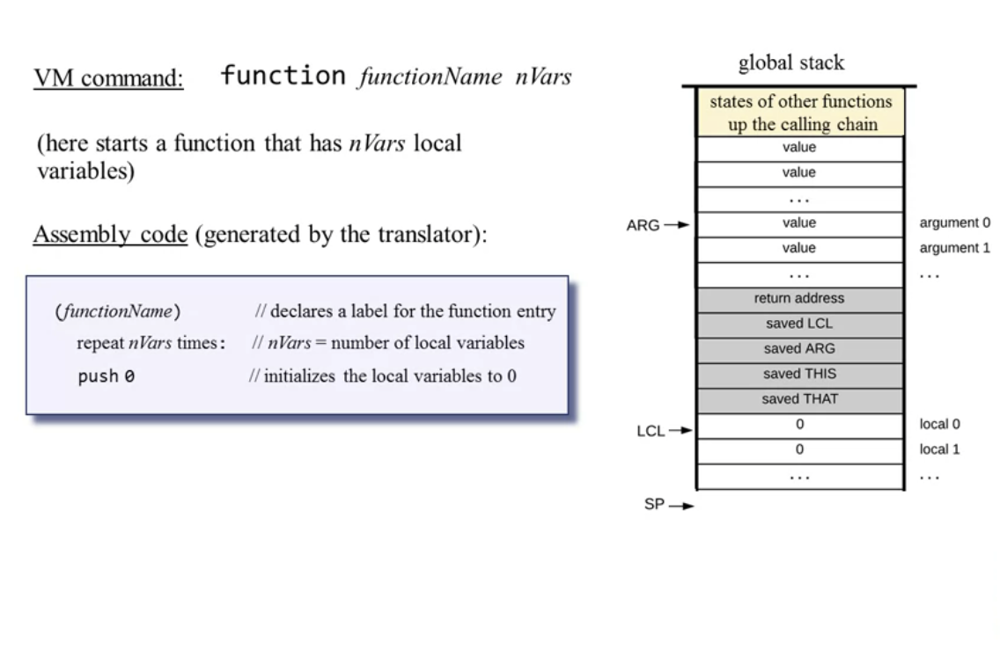

#### return command

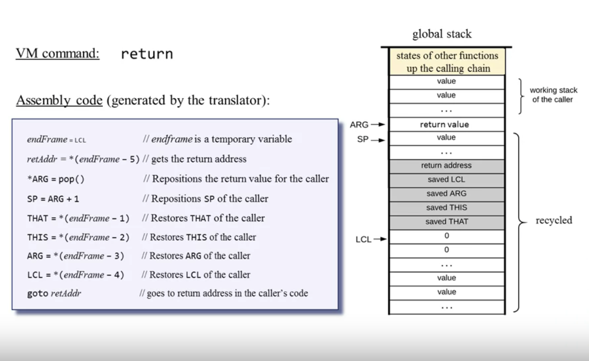