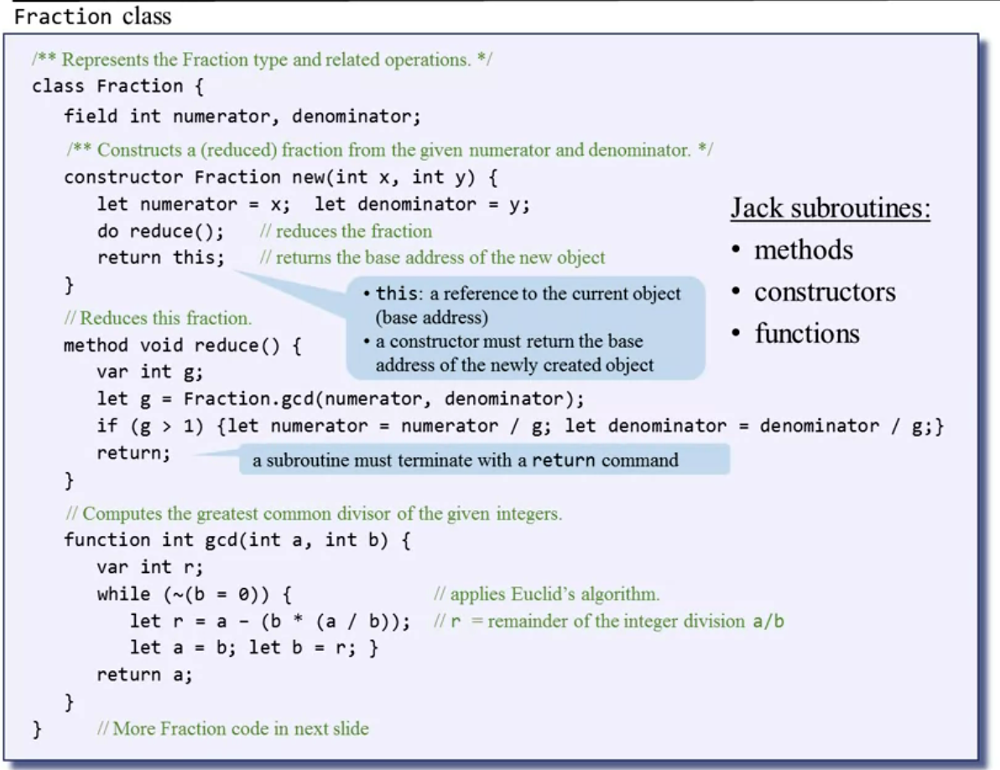
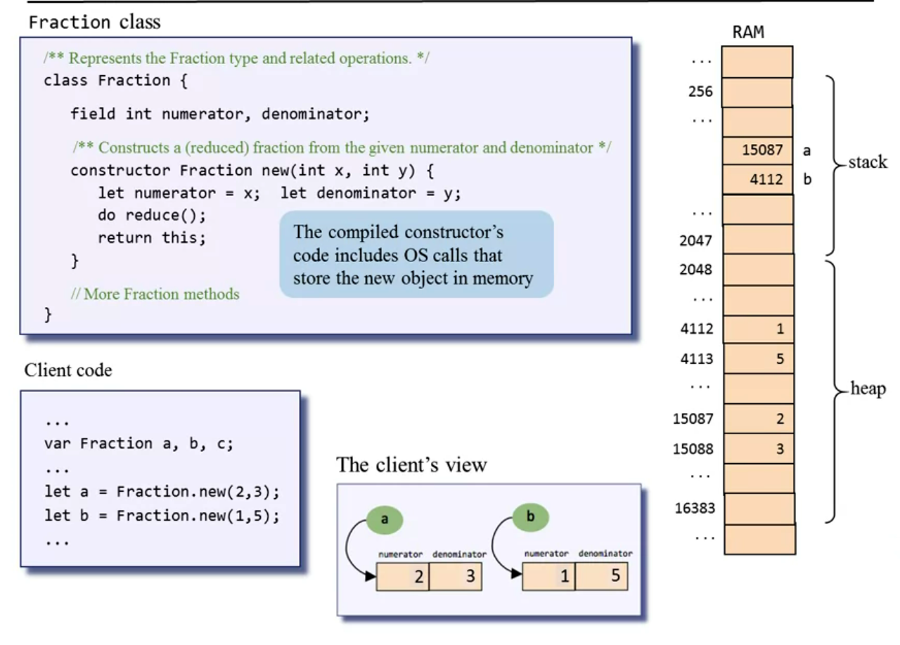
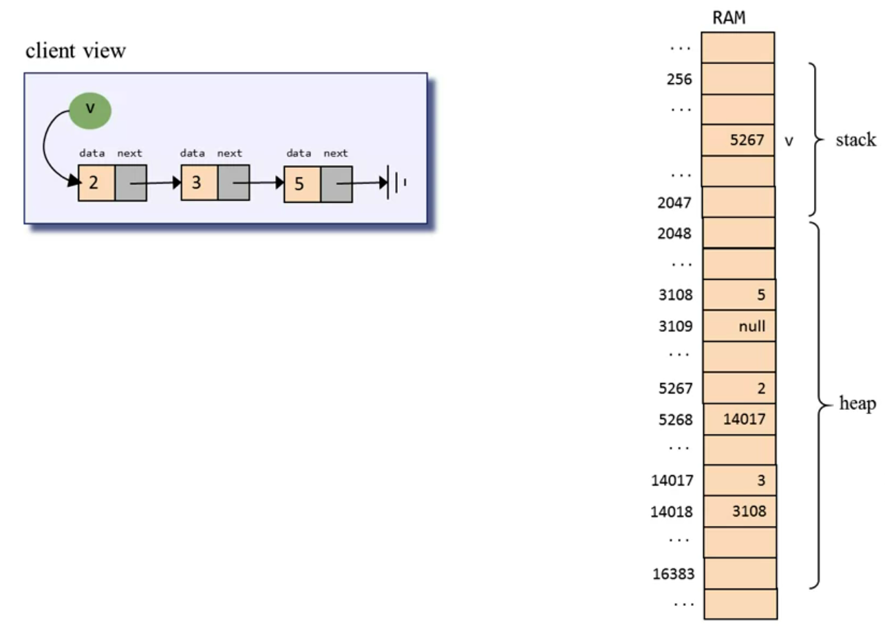
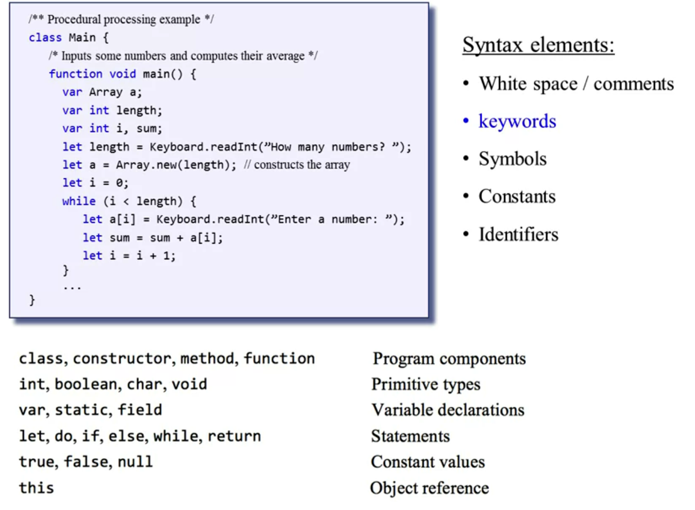
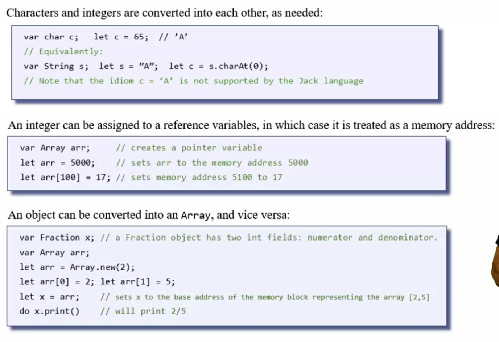
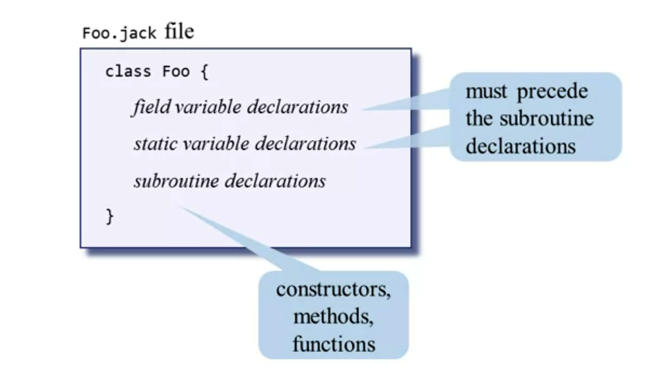
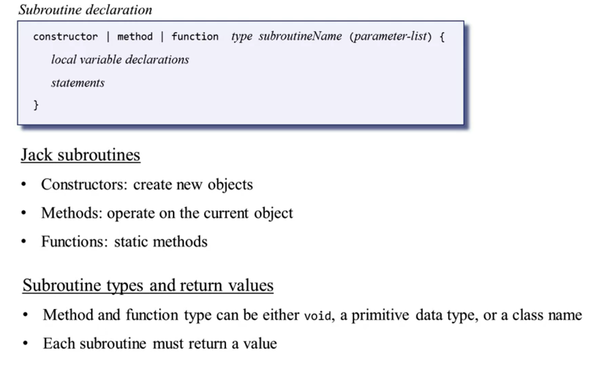
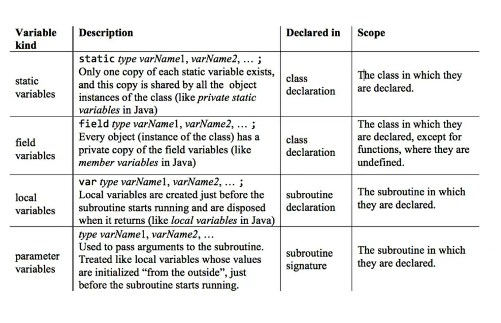

# HIGH LEVEL LANGUAGE

## The Jack Language in a nutshell

- A simple Java-like language.
- Object-based, no inheritance.
- Multi-purpose.
- Lends itself to interactive apps.

### Components

- Comments:
  -  /** API block comment */
  - /* block comment */
  - // in-line comment
- Procedural processing: 
  - A jack program is a collection of one or more jack classes, one of which must be named Main.
  - The Main class must have at least one function named main.
  - Program's entry point: Main.main
- Flow of control: 
  - if/ if ... else
  - while 
  - do
- Arrays are implemented as instances of the array class. And arrays are not typed.
- OS services:
  - Keyboard.readInt
  - Output.printString
  - Output.printInt
  - More ...
- Jack data types:
  - Primitive:
    - int
    - char
    - boolean
  - Class types:
    - OS: Array, String, ...
    - Program extensions: as needed.

## Object-Based Programming

- In jack a Jack class can access field variables of another jack class only indirectly, through accessor method (field cannot be declared public).

**NOTE**: 

-  The constructor must return this: a reference to the current object (base address). Java does the same, we don't see it because the compiler's translation. When compiling the constructor, the compiler calls to OS routines that find, and allocate, available memory space for the new object.
- The method (void included) must always terminate with a return (again the java's compiler does this job for us).

**Garbace Collection**: Jack has no garbage collection. Object must be disposed explicitly with the OS routine to recycle the object's memory: **do Memory.deAlloc(this)**. Every class that allows the construction of objects should feature means to dispose them. If a class consists only of functions, there is no need to worry about object construction and disposal.

### Object representation

In the stack we have everything related to the work that needs to be performed. Variables, memory segments, function chain and so on. After the stack we have the heap where we represent objects and array.

We see in the example below that we have a variable called "a" and "b". If we look in the global stack, associated with the variable "a" we have the base address, meaning the object's memory start, indeed, we can see at location 15087 the first argument and 15088 the second one (in the heap).

## E.G. List

## Jack Language Specification

### Syntax

In the Jack language, integers are always non-negative numbers. The number -7 is interpreted as the unary operator “minus”, applied to the positive constant 7.

### Data Types

- Primitive Types:

  - int
  - boolean
  - char

- Class types:

  - OS types: String, Array
  - User-defined types: Fraction, List, ...

- Type conversions: 

  

### Classes

- Class = basic compilation unit.
- Each class Foo is stored in a separate Foo.jack file.
- The class name's first character must be an uppercase letter.

***Jack's standard class libraries/ OS***

### Method

*** variables***

