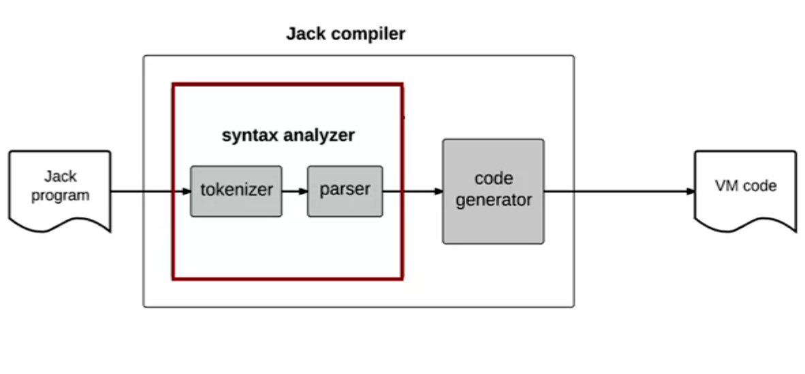

# COMPILER I: SYNTAX ANALYSIS

## Lexical Analysis

**Tokenizing** = grouping characters into tokens

A token is a string of characters that has a meaning and a programming language specification must document its allowable tokens.

## Grammars

A grammer is a set of rules, describing how tokens can be combined to create valid language constructs. 

Each rule consists of a left-hand side, listing a template's name, and a right-hand side, describing how the template is composed

**Parsing**: Determing if a given input conforms to a grammar. In the process, uncovering the grammatical structure of the given input.

## Parse Trees

E.g. 

## Parser Logic

- Follow the right-hand side of the rule, and parse the input accordingly.
- If the right-hand side specifies a non-terminal rule xxx, call compileXXX.
- Do this recursively.

### Parser Design

**NOTE**: 

- LL grammar: can be parsed by recursive descent parser without backtracking.
- LL(k) parser: a parser that needs to look ahead at most k tokens in order to determine which rule is applicable.
- The grammar that we saw so far is LL(1), english for instance is not, because we can't determine the rule just looking the next word.

## The Jack Grammar

## The Jack Analyzer

