# COMPILER II: CODE GENERATION

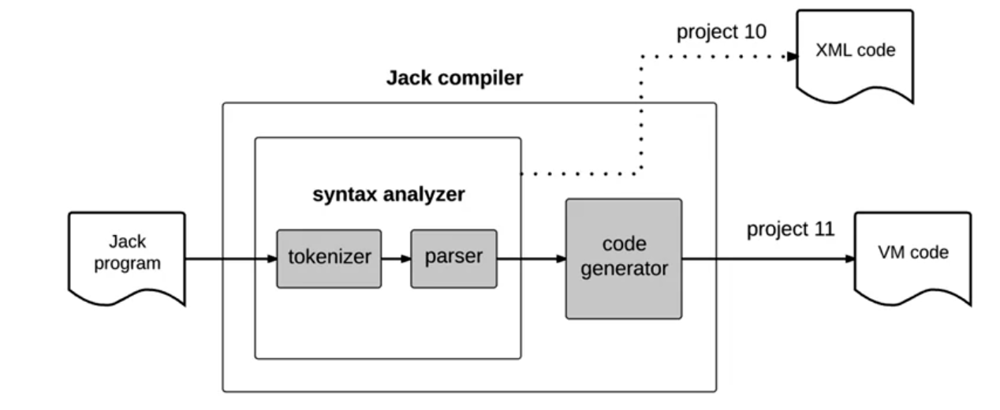

## Handling Variables

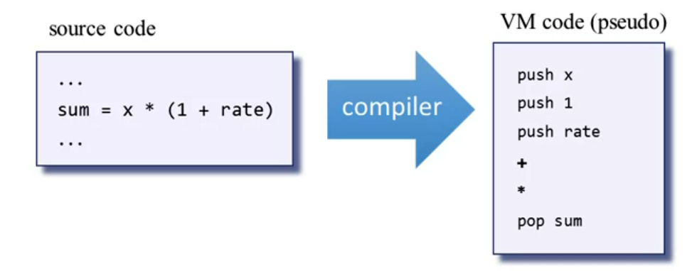

### Symbol Tables

We have one symbol table per scope. In our jack language we have only 2 scopes, class scope and method scope. 

**Note**: Whenever you construct a symbol table for a method, it has as argument 0, **this**, that points to the class base address, it is an implicit argument. 

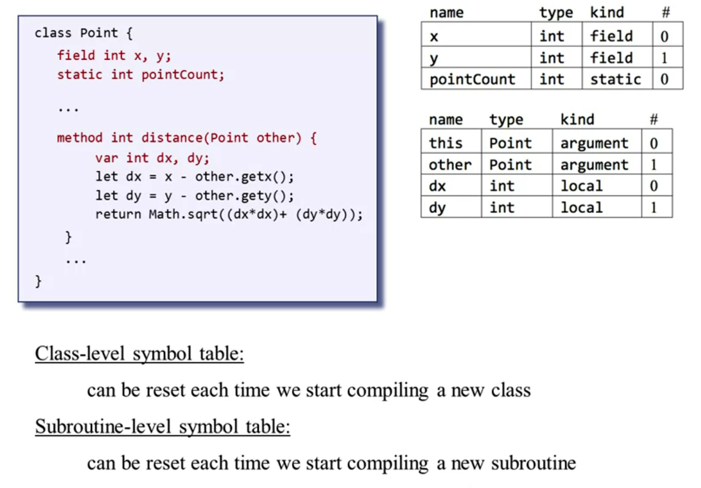

**Lookup algorithm example**: If we have in the method: let dx = x - other.getX(); the first thing we do is looking up the variable in the subroutine-level symbol table; if not found, look it up in the class-level symbol table, if is not there either, we can conclude that this variable is undefined and throw an error.

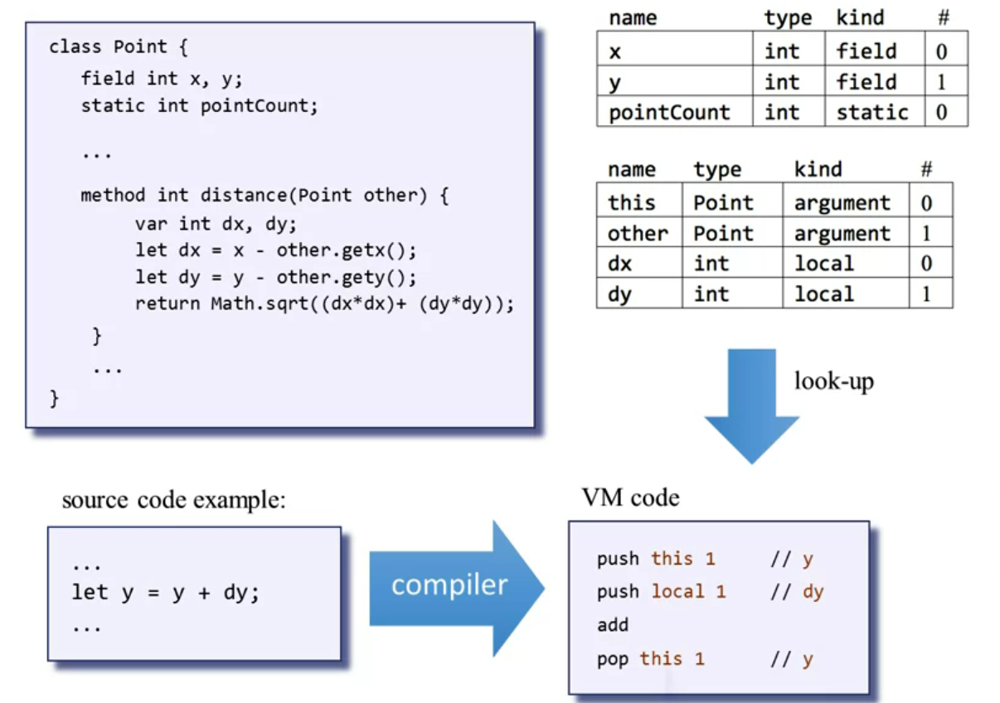

This mechanism can be implemented through a list:

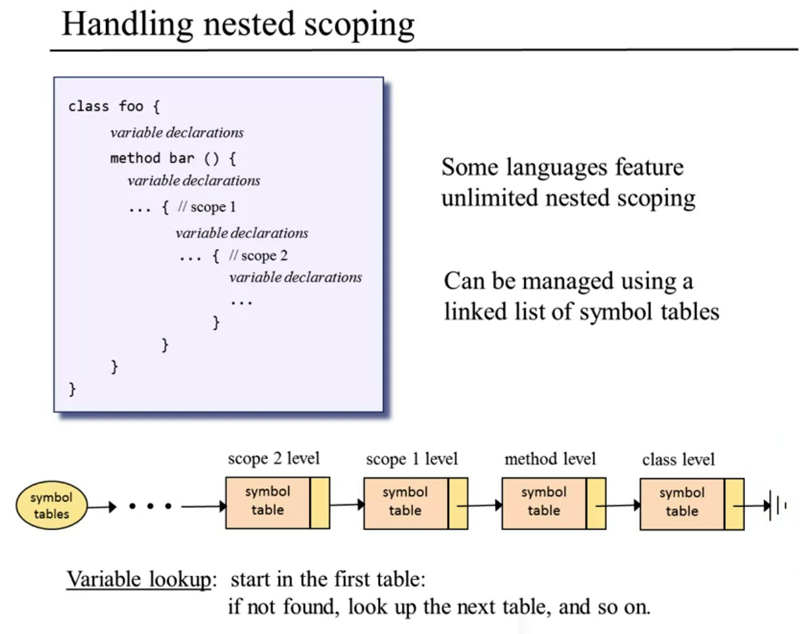

## Handling expressions

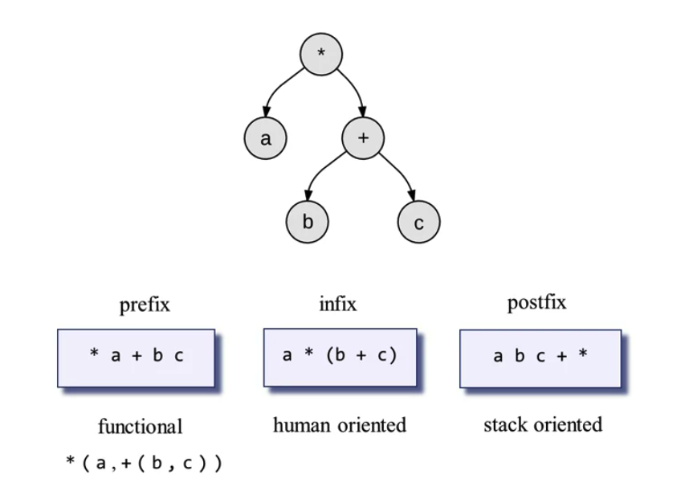

We should translate with the compiler from infix notation to postfix notation (stack oriented because in if we have a b c + *, we pop b c and perform + and from the resulting value we * with a, it is like our stack). How we do it?

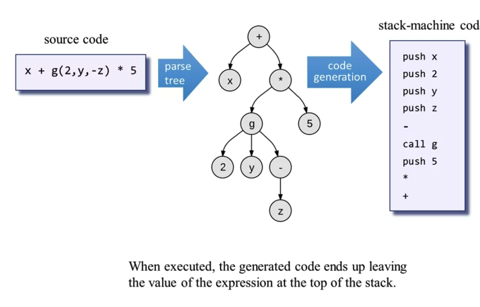

We can use DFS to apply what is shown in the picture.

**Note**: The tree is provided by the parser of the unit-10.

## Handling Flow of Control

### Compiling if statements

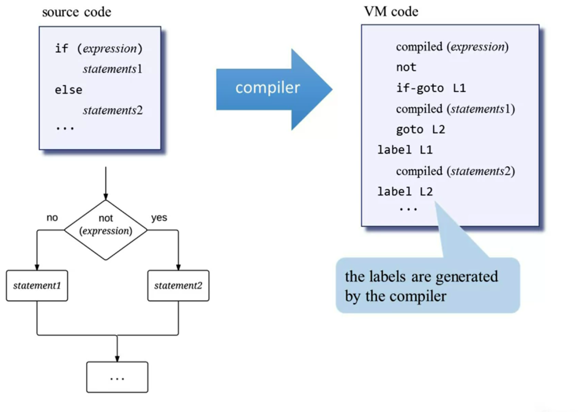

### Compiling while statements

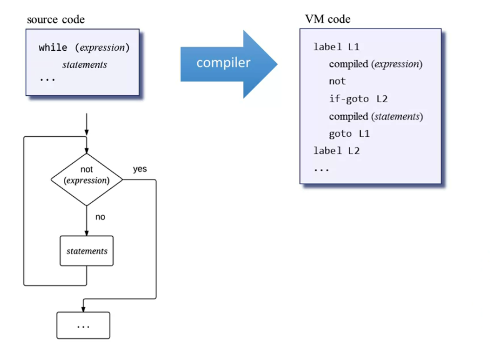

### Handling Objects

Before inserting an object,  we have to set the base address in the stack: pointer 0 (this) or pointer 1 (that), to tell which object or array in the heap we wanna access.

**NOTE**: Before using the object (this) or array (that) segment, we must first anchor them using pointer, to point to the memory in the heap ( e.g. pop pointer 0).

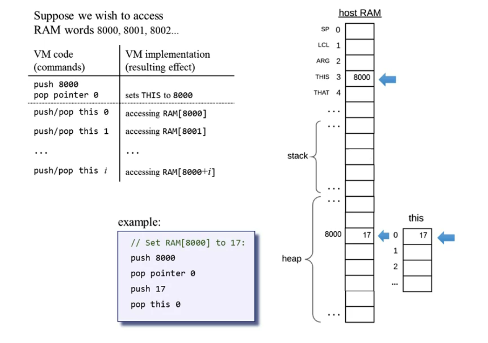

### Object Construction

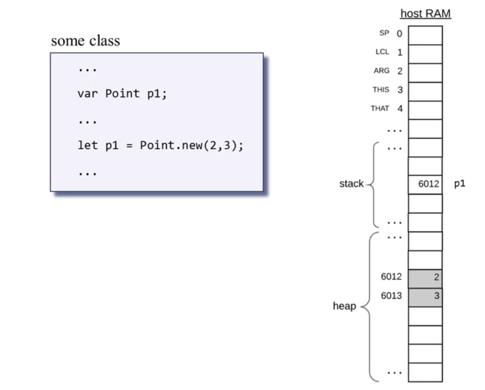

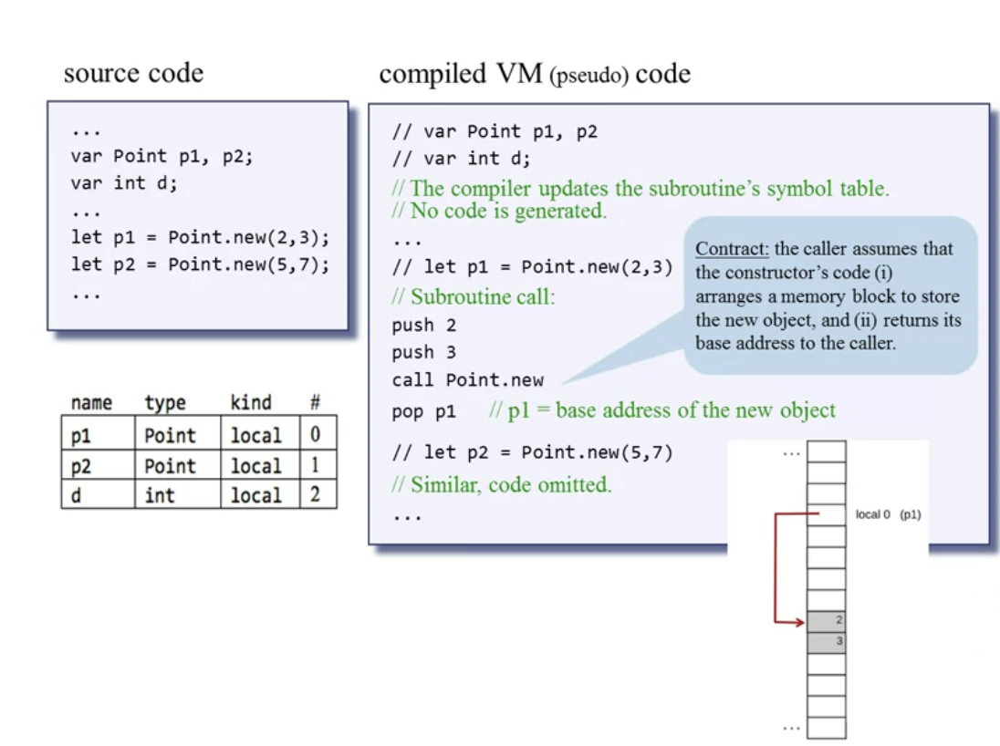

**Note**: 

- During compile-time the compiler maps p1 on local 0 and p2 on local 1.
- During run-time, only during the execution of the constructor's code effects the creation of the objects themselves on the heap.

Therefore the constructor's code typically needs access to the object's fields. **How to access the object's fields**: 

The constructor's code can access the object's data using the **this** segment. **But first, the constructor's code must anchor the this segment on the object's data, using pointer**.

**How do I find space free in the heap for the object?**: Here comes to play the OS, if we do alloc(5), then alloc will find a memory block in the RAM that is 5 words long and is free. Alloc is going to return the basic address of the newly created object, so I ca anchor the value returned to the pointer base address and start pushing the value in the constructor. At the end of the constructor's creation we return the base address that is stored in the pointer.

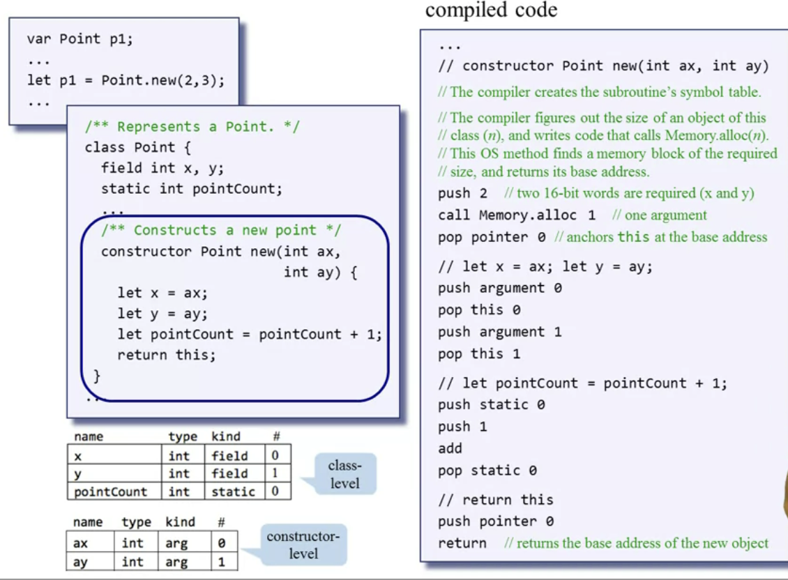

## Handling Objects: Manipulation

### Compiling method calls

**The compiler must rewrite the OO method calls in a procedural style: to do so, the object is always treated as the first implicit argument.**

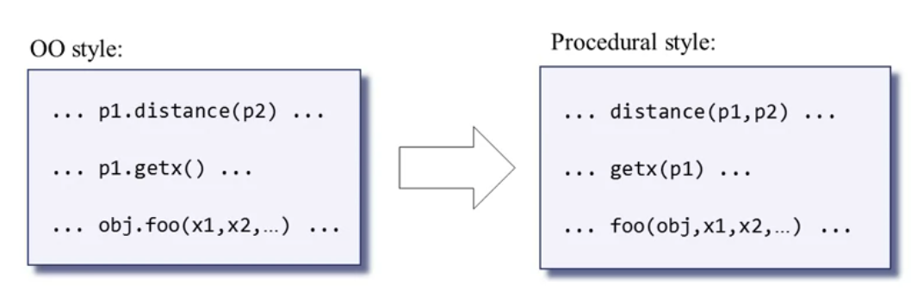

**How to access object's fields from the method?**

The method's code can access the object's i-th field by accessing this i. But first, the method's code must anchor the this segment on the object's data using pointer.

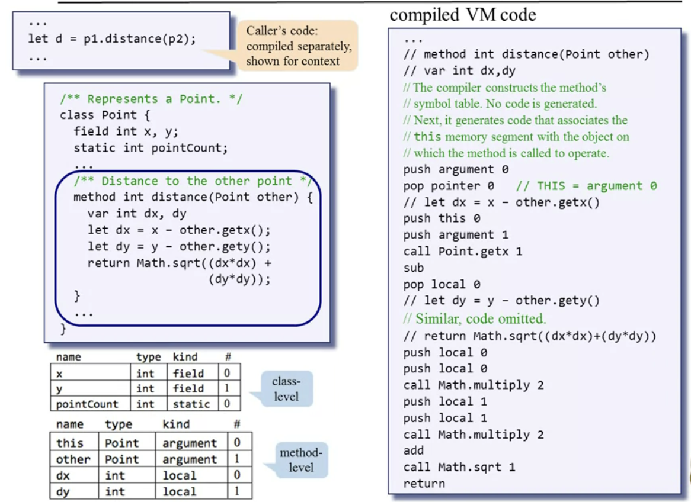

Now the method has to return, all the methods return, it returns to the caller.

**How do we handle void methods?**

The method must return a value, but if I have nothing to return, as a convention I push constant 0 and then I return. But the stack now contains now an uneccesary value, so we pop temp 0 and we remove this unnecessary value from the stack.

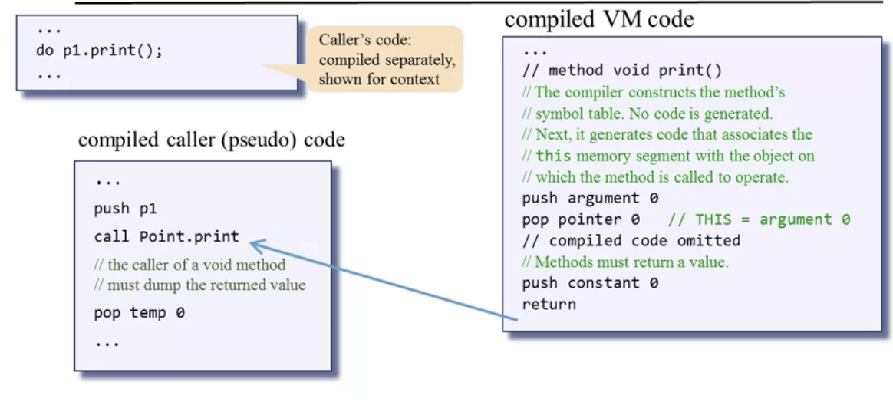