# OPERATING SYSTEM

System oriented services provided by the OS:

- Memory management (objects, arrays, ...)
- file system
- I/O device drivers
- UI management (shell/ windows)
- Multi-tasking
- Networking
- Security

We are going to implement some of those functionalities:

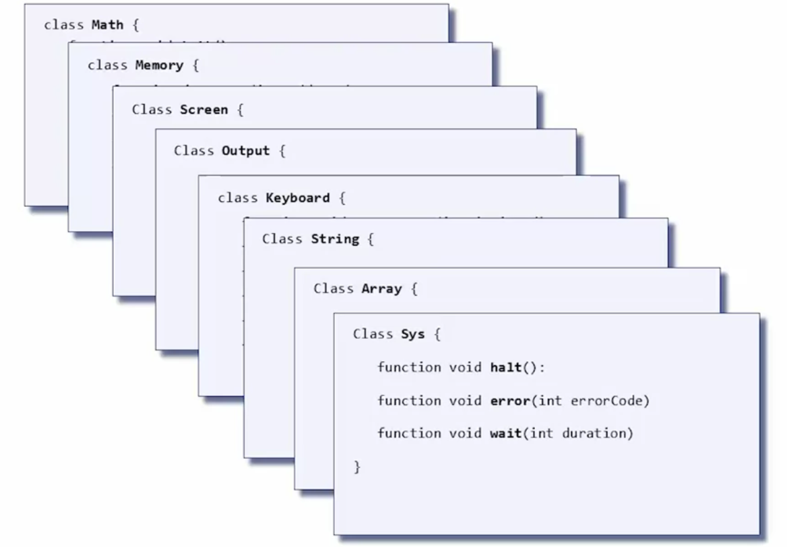

## Math: Efficiency Matters

### Multiplication

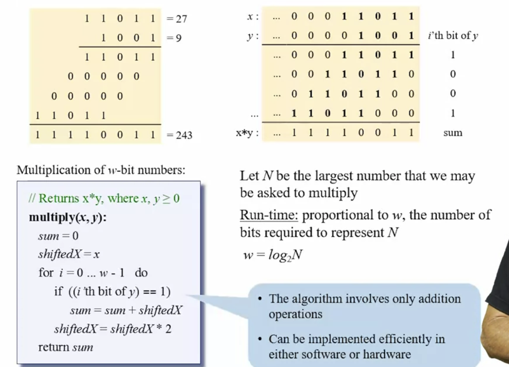

### Division

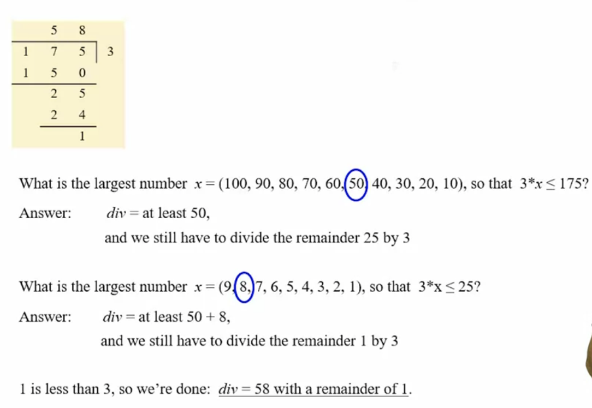

### Square Root

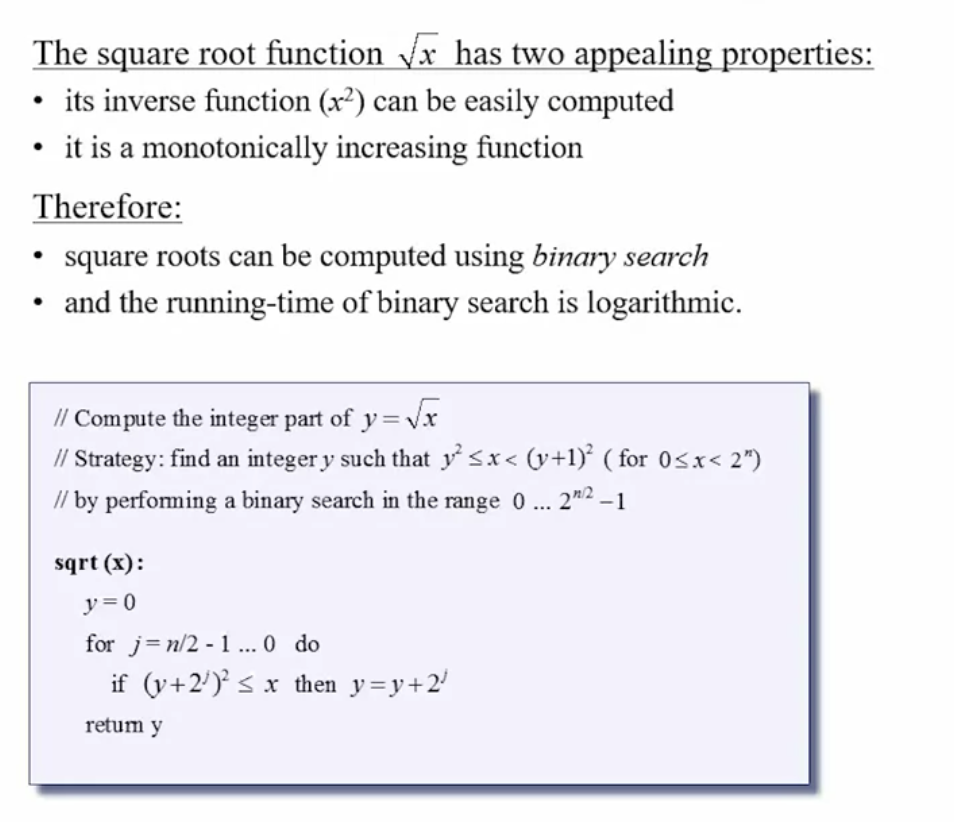

## Memory access

The program access the RAM, but doesn`t know about the RAM itself. The OS creates an abstraction between accessing variables, objects, arrays etc. and the RAM itself. The OS provides low-level services that facilitate direct RAM access. Based on thesw low-level services, the OS features higher-level memory and I/O management services.

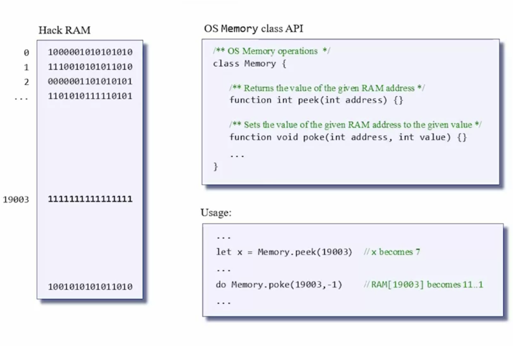

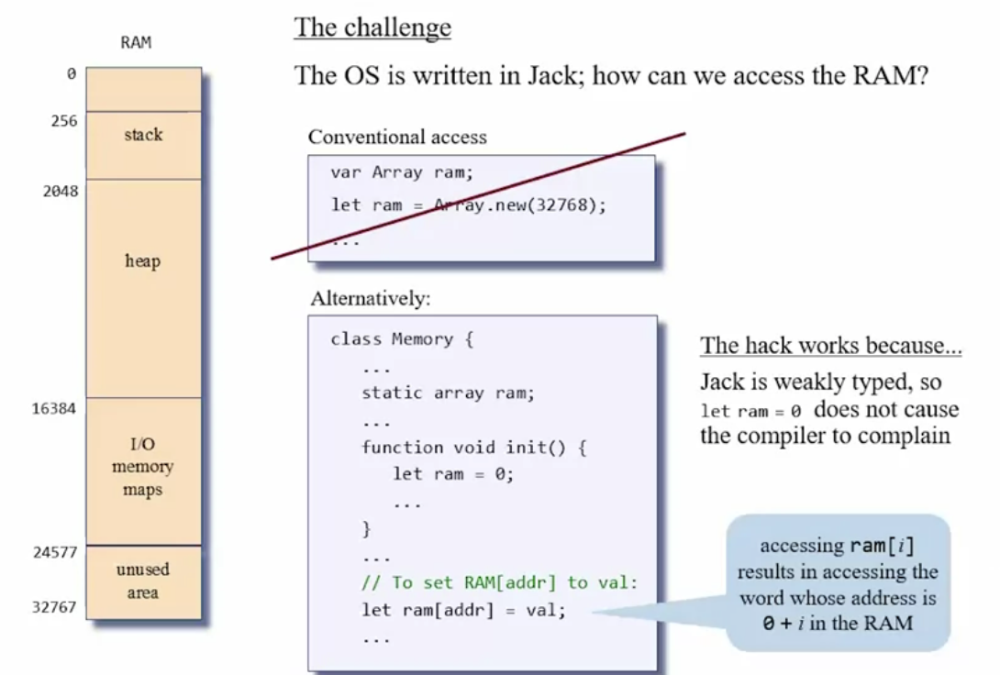

## Heap Management

During run-time, programs typically create objects and arrays. Objects and arrays are implemented using:

- Reference variables.
- Poiting at actual data blocks (in the heap).

The challenge:

- Allocating memory for new objects/ arrays (alloc).
- Recycling memory of disposed objects/ arrays (dealloc).

**Solution:**

Use a linked list to keep track of available heap segments available (at beginning one element in the list that is the entire RAM).

- alloc(size): find a block in the linked list of size "size", remove it from the linked list, and give it to the client.
- dealloc(object): append the object/block to the freeList.

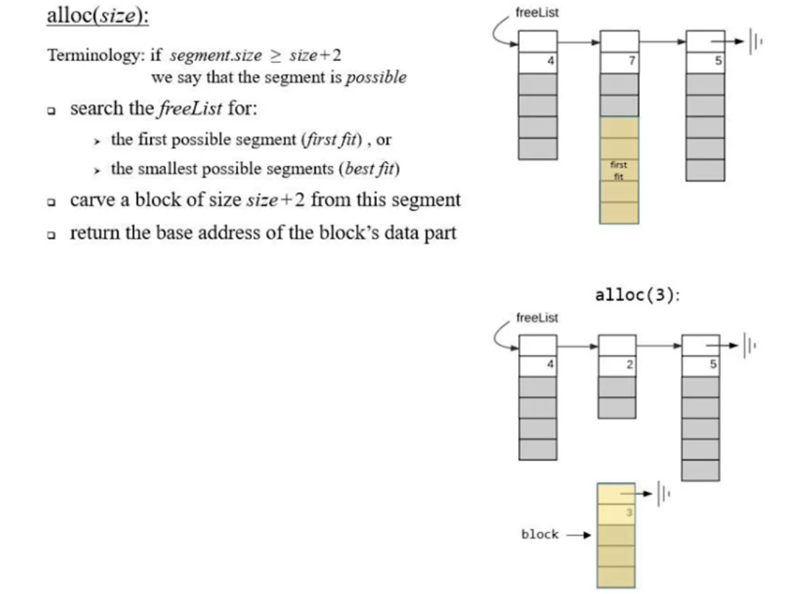

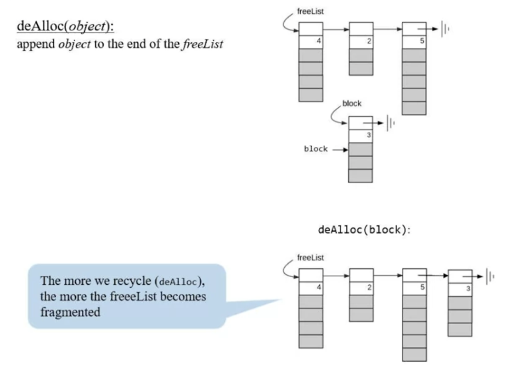

**NOTE:** We have a procedure called **defrag** that everytime in a while goes in the list and tries to merge the fragmented block in this way he list becomes smaller and the alloc is faster.

## Graphics

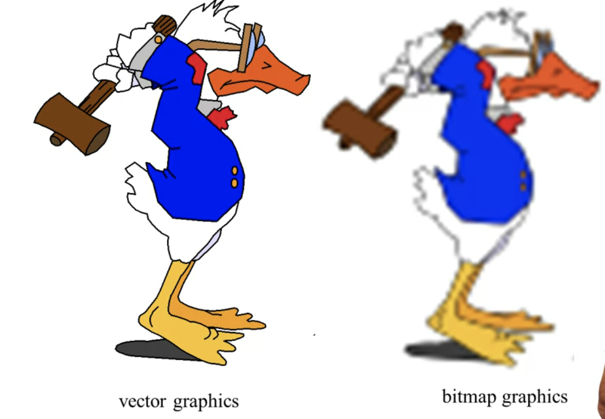

**Bitmap graphics file**: For each bit that is back I store 1 and for each pixel that is white I store 0 (in the RAM chunk screen memory map).

**Vector graphics file**: Instead of recording the information in the figure (pixel), I record a set of instruction that specify how to draw the figure

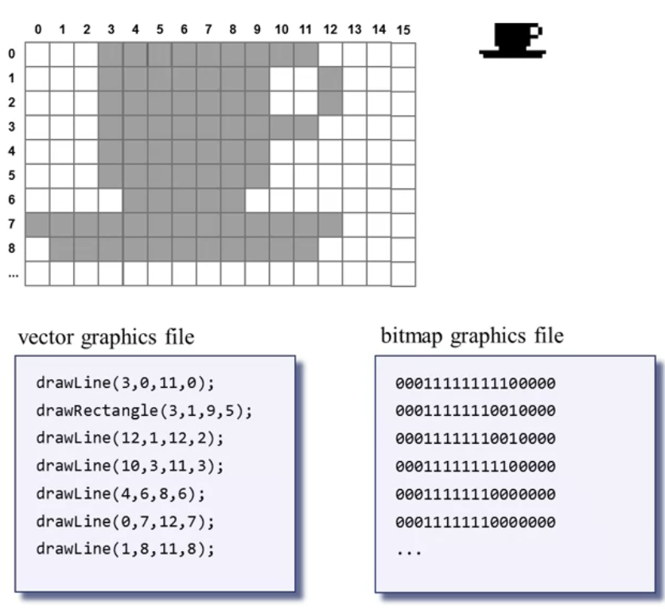

**Advantages of vector graphics**:

- If you try to scale up the bitmap file it doesn't scale properly, because the only thing we have is the pixel information. 
- In vector graphic we get perfect scaling, because we have a set of instruction and if we want to draw the cup on different resolution, all we have to do is to manipulate those instructions.
- Vector graphic contains little information and so can be easily transmitted over the internet.
- Can be turned into bitmap.

## Sys Class

**Bootstrapping(booting)**: The process of loading the basic software into memory of a computer after power-on or general reset, especially the operating systems which then take care of loading other software as needed.

**Hardware contract**: When the computer is reset, execution starts with the instruction in ROM[0].

**VM contract**: The following code should be place at the top of the ROM, beginning in ROM[0]:

- SP = 256

- call Sys.init

**Jack contract:**

Program execution starts with the function Main.main()

**OS contract**

Sys.init should initialize the OS, and then call Main.main()

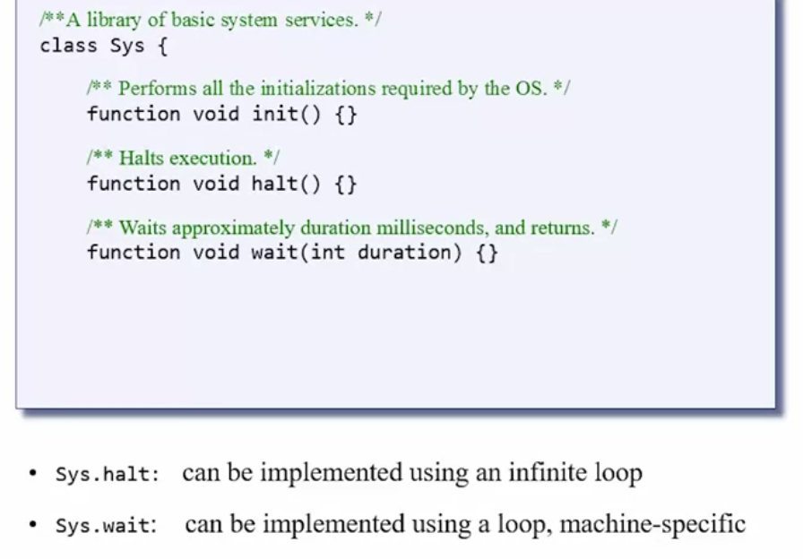

